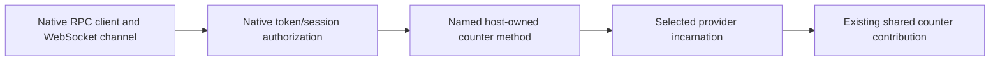

# Native server context examples

This package runs the same counter capability and action in a real `DevframeHubContext` and a real `KitNodeContext`. It imports the unchanged contracts from `@devkit/example-contribution`. Both hosts start the same service and action plugin through `createDevframeProvider` / `createDevToolsProvider` from `@devkit/server`.

The service uses the typed `devframeHubContext` descriptor to access native shared state and registers a native command that reads the counter. Its activation owns that command. Disabling the service removes the command and puts the dependent action into waiting. Enabling the service registers the command again and reuses the host's retained counter state.

`src/host.ts` constructs the contexts with public `createHubContext` and `createKitContext` factories, then initializes a headless hub. It uses a temporary storage directory, opens no network listener, and closes the hub before removing the directory. The adapter owns its contributions; the example owns the native host.

## Run

From the repository root:

```sh
pnpm install --frozen-lockfile
pnpm --filter @devkit/example-server-contexts... run build
pnpm --filter @devkit/example-server-contexts run demo:devframe
pnpm --filter @devkit/example-server-contexts run demo:devtools
pnpm --filter @devkit/example-server-contexts run demo:routing
pnpm --filter @devkit/example-server-contexts run demo:remote
pnpm --filter @devkit/example-server-contexts run test
```

Each demo prints its configured provider ID, adapter-issued incarnation, execution descriptor and actual native context availability. The first action and capability read return `3`. After disabling and enabling the service, the next action and native command return `7`. The incarnation stays unchanged across activation changes. Provider disposal removes the owned command while the native shared state still contains `7`. The runner then closes the host.

The executable check imports the built package exports and runs both paths, asserting these values and statuses. It exits unsuccessfully if either path fails. Each runner awaits host cleanup before its promise fulfills. It does not mock context construction, state, service calls, actions or cleanup.

```sh
pnpm --filter @devkit/example-server-contexts run typecheck
pnpm --filter @devkit/example-server-contexts run lint
pnpm --filter @devkit/example-server-contexts run format:check
```

## Custom contribution kind

Both `demo:devframe` and `demo:devtools` also run the [custom command contribution](./src/custom-command.ts). `defineContributionKind` declares its schema, `defineExtension` supplies a title/message payload, and the host supplies a typed `ContributionKindInstaller`. Definitions remain inert until the provider installs the plugin.

```ts
const provider = await createDevframeProvider({
  context,
  providerId: 'example.devframe-server',
  kinds: [commandInstaller],
  plugins: [commandPlugin],
});
```

The installer retrieves the existing `devframeHubContext`, registers an ordinary native command under the contribution ID, and registers `command.unregister()` with the activation scope. The same installer works with `createDevToolsProvider` because that host exposes the same native hub API. The SDK owns contribution activation; the native context owns command execution.

The printed `customCommand` result shows the greeting when ready, no registered command after disable, a working greeting after reenable, and no command after disposal. [The two native-host tests](./tests/custom-command.test.ts) assert those results through this package's built exports. The native Vitest JSON report feeds the API inventory. This example covers headless native hosts; browser UI, extension-host custom kinds and reload behavior remain separate acceptance work.

## Two-provider routing

`demo:routing` creates both native hosts together and attaches their provider handles to `@devkit/client`. An ordered default initially increments the Devframe counter to `3`. Disabling that service routes the next increment to DevTools, reaching `4`; a callback selects DevTools again, reaching `6`. After re-enabling Devframe, a broadcast requesting its provider and a missing provider rejects before dispatch. Capability broadcast reads confirm unchanged counters `[3, 6]`.

A broadcast with overlapping realm/provider selectors then increments each counter once, returning `[4, 7]`. Client disposal leaves native commands and state alive; reading them still returns `[4, 7]`. The runner subsequently disposes both providers and closes both hosts. `checks/routing.ts` asserts these receipts through the built package export.

## Authenticated native RPC

`demo:remote` opens a temporary loopback HTTP/WebSocket host for each native context. It reuses the same counter contracts and implementations, Devframe's `createInteractiveAuth`, named native RPC definitions, and the public `createRpcClient` / `createWsRpcChannel` exports. Node's actual WebSocket implements the client channel; no browser globals or transport mocks are installed. Every run creates a fresh in-memory credential and temporary storage directory. It prints no credentials, removes its storage, and closes both sockets and hosts before returning. Expected auth, validation and disposed-provider failures produce native diagnostics during the check.

The example supplies services, plugins and `expose` in one provider startup call. The adapter registers four host-owned methods: the action, the capability’s `read` and `increase` operations, and its catalog query. Each captures its provider, checks the expected incarnation and delegates through the existing lifecycle. Two example-only native probes inspect session trust and handler behavior across disconnect. None is advertised as an agent tool.



`checks/remote.ts` runs the built package export on both Devframe and DevTools and asserts:

| Scenario                                          | Observable result                                                                             |
| ------------------------------------------------- | --------------------------------------------------------------------------------------------- |
| Invalid credential                                | Native authorization rejects; the counter is unchanged.                                       |
| Valid credential                                  | The action returns `3` and its native session is trusted.                                     |
| Capability operations                             | Reading returns `3`; increasing by `2` returns `5` through the same native boundary.          |
| Invalid input                                     | Native schema validation rejects before a counter change.                                     |
| Provider disposal                                 | Its action rejects; unrelated HTTP still returns `host-alive`.                                |
| Same-ID provider replacement                      | The old incarnation rejects; a fresh call returns `9`, using retained native state.           |
| Actual native host shutdown during a pending call | The channel closes the native RPC client and the pending client call rejects.                 |
| Already-started server handler after disconnect   | Releasing its gate still lets it finish. Client rejection does not prove server cancellation. |
| Host-owned declaration count                      | The four adapter methods remain registered across provider replacement; no names accumulate.  |

The low-level native client needs its `$close()` connected to the channel's disconnect/error callbacks. The example does that directly, with no additional request-ID registry or RPC codec. The native high-level browser client already owns its own connection guards. A five-second native RPC timeout bounds failed calls in this executable example; it is not a server-side cancellation mechanism.

The [native lifecycle investigation](../../docs/research/native-rpc-lifecycle.md) records missing coherent dynamic RPC removal and server-side ordinary-call cancellation through an existing hub. The owner has since selected host-owned remote methods, which avoids requiring dynamic removal. The combined startup API is implemented. The native remote client and catalog synchronization are now implemented. Native backend unary cancellation remains absent, as accepted by the owner.

## Browser client

```sh
pnpm exec turbo run build --filter=@devkit/example-server-contexts...
pnpm --filter @devkit/example-server-contexts demo:browser devframe
# Or run against the native DevTools backend:
pnpm --filter @devkit/example-server-contexts demo:browser devtools
```

Open the printed loopback URL. The page creates an isolated native `connectDevframe` client and passes it to `createDevframeProviderConnection` from `@devkit/server/client`. After the provider attachment authenticates, the page reads the native shared-state key and subscribes with `state.on('updated', ...)`. The shared router invokes the action when the button is pressed. Command completion is shown separately from the observed counter value. No credentials are printed or stored in browser caches. The launcher injects its temporary demo credential into its loopback-only Vite page and proxies the native endpoint; use application-owned authentication in a real host.

Open the URL in two tabs. Increment in either tab and both counters update. Disconnect one tab: its value is marked stale and its actions are disabled. Increment the other, then use **Reload to reconnect** in the disconnected tab. It creates a new native client and reads the current value with the same backend incarnation. This is explicit reconnection, not automatic recovery or operation replay.

Both hosts passed that live in-app browser flow: `0 → 1` in both tabs, a disconnected peer retained `1` while the other reached `2`, reconnect read `2`, and the remaining peer reached `3` after the first tab closed. A separate host retained its own value. Actual DevTools host shutdown also marked the open view stale. [Evidence and native limits](../../docs/research/native-state-observation.md) record the checks.

The page owns its native client; page/HMR disposal releases state listeners, the shared client, adapter subscriptions and native socket. The launcher owns the backend and Vite server; type `replace` to replace the portable provider while retaining native host state. The old page's action binding rejects; reload to attach to the new provider incarnation and continue from the retained value. Any other terminal input closes both servers and removes temporary host storage. An explicitly supplied counter file is retained. The native state API remains writable under this example's host policy. UI-only action usage does not establish backend-only write authority. This is a diagnostic page, not the JSON renderer example.

`checks/browser-build.ts` builds the browser entry using public package exports and rejects Node shims or backend runtime modules. Server-package socket tests additionally exercise authenticated catalog reads, invalid metadata, disable/enable, replacement, stale-query fencing, startup cancellation and caller/client/adapter/disconnect cancellation. Each cancellation path stops waiting while the backend finishes once. Test-only `location` supplies the environment required by the native browser client; transport, auth and handlers are real.

## Optional native counter persistence

Supply a file to retain the counter across native host restarts:

```sh
pnpm --filter @devkit/example-server-contexts demo:browser devframe /tmp/devkit-devframe-counter.json
pnpm --filter @devkit/example-server-contexts demo:browser devtools /tmp/devkit-devtools-counter.json
```

The equivalent example API is `createRemoteHost('devframe', { counterStoragePath: '/absolute/path/counter.json' })`. The host publishes Devframe's public `createStorage` value under the existing `example:server-counter` key before installing the unchanged service and action. Native client writes and portable actions update the same shared state. Omitting the path keeps the existing ephemeral behavior.

The caller owns the file. Closing the host removes its temporary auth/host directory, but never deletes the supplied counter file or its parent. A path identifies this example's stored record; use separate paths for independent hosts. Only one live host should own a path. This example provides no cross-process locking, file watching, merge policy, migrations or cross-provider replication.

Devframe writes asynchronously after its native debounce, currently 100 milliseconds. An action result or observed state update does **not** confirm that the file was written. Open two tabs, increment the counter, inspect the actual JSON file, then stop and restart the command with the same path. Fresh clients attach to a new provider incarnation and read the saved value. No operation is replayed and no automatic reconnect is added.

Saved data must be exactly `{ "value": <integer> }`. Native `mergeInitialValue` applies the example's schema. Malformed JSON or an invalid saved shape produces Devframe's `DF0012` warning and starts at zero; the file remains unchanged until a later state mutation. A native write failure emits `DF0035` in the server terminal while the live state and action result remain available. It does not roll back the counter or become a rejected action. After restart, only a successfully saved value can be restored. The public native store exposes no flush or disposal operation: host shutdown does not promise to flush or cancel a pending write, and abrupt process exit can lose recent changes.

[`tests/persistence.test.ts`](./tests/persistence.test.ts) runs ten real HTTP/WebSocket tests across both native hosts. They verify two-client action/state updates, native client writes, physical file contents before shutdown, a fresh incarnation restoring the value, independent paths, caller-owned file retention, malformed and schema-invalid saved data, and a real filesystem obstruction that prevents saving. Two further cases repair the caller-owned obstructing path without replacing the native host or either client. A new explicit action saves the retained counter, a direct native peer mutation continues to replicate and save, and only then do fresh clients restore the observed write. The same provider incarnation and connected native clients remain in use during recovery. The existing six ephemeral-state tests still pass using the same client fixture. These checks preserve native diagnostics and do not claim crash consistency, atomic updates across processes or WebExtension storage support.

Live in-app browser confirmation used two pages per host and separate caller-owned files. Devframe reached `2` and DevTools reached `1`; the physical files contained those values before shutdown. Restarting each command with its original path produced a new incarnation and restored the same value in both pages. Another action reached `3` and `2` in the respective peers and files. Both launchers stopped cleanly. The [observed identities and values](./evidence/persistence/browser-observations.json), [Devframe screenshot](./evidence/persistence/devframe-restored.jpg), [DevTools screenshot](./evidence/persistence/devtools-restored.jpg), and final file contents for [Devframe](./evidence/persistence/devframe.json) and [DevTools](./evidence/persistence/devtools.json) are retained. This is an explicit stop/restart check after an observed write, not an abrupt-exit durability guarantee.

Live in-app confirmation of path repair used the unchanged diagnostic controls and two pages per host. Both reached `1` while native persistence emitted `DF0035` and the path still failed with `ENOTDIR`. Repairing the path left no counter file at that observation. A new explicit action from the other page reached `2` in both peers and the actual saved JSON, with unchanged provider identities. No reload, reconnect control or provider replacement occurred during recovery. [Visible observations and limits](./evidence/persistence/path-repair/browser-observations.json), [Devframe screenshot](./evidence/persistence/path-repair/devframe.jpg), and [DevTools screenshot](./evidence/persistence/path-repair/devtools.jpg) retain the manual check. This is separate from automated browser-conformance receipts. Owned tabs, servers and disposable storage were removed afterward.

## Scope

The exported `createRemoteHost` also accepts a configured `providerId` and the native hub `allowedOrigins` option. The [extension example](../webext/README.md#explicit-native-server-connections) uses these to connect real Devframe and DevTools hosts simultaneously from one extension page. Defaults remain `example.remote` and native loopback-origin admission. Provider replacement retains the configured ID and changes its incarnation.

The local demos exercise in-process routing; `demo:remote` checks low-level native RPC on both hosts; `demo:browser` uses the shared routed client over an actual native browser connection. Catalog synchronization is implemented for explicit exposure. Automatic endpoint discovery, browser capability authority, the JSON renderer, extension execution and complete browser HMR/conformance remain separate work. The DevTools example uses a real kit backend without presenting the DevTools UI.

`tests/state.test.ts` adds six real-socket tests across both native hosts for peer observation, separate host values, unsubscribe, explicit fresh-client recovery, native client writes and provider replacement with surviving state/observers. A separate fresh host starts from the initial value. Native lifetime and write policy are accepted defaults; contributions/hosts own state keys, resource scope, validation, persistence and conflicts. [State scope and recovery](https://github.com/dvcol/devkit-extension/issues/8) tracks the remaining host integration proof.
