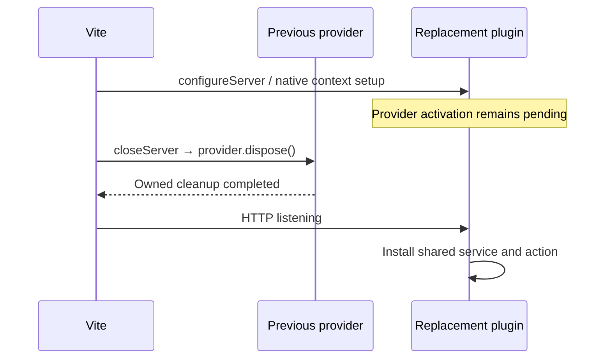

# Native Vite host examples

One counter capability, service and action run in both the released `@devframes/vite/hub` integration and the actual `@vitejs/devtools` Vite plugin. The recipes come from `examples/server-contexts`; this example adds native Vite lifecycle wiring. It does not implement a portable remote transport or a JSON counter view.

From the repository root:

```sh
pnpm exec turbo run build --filter=@devkit/example-vite-hosts... --concurrency=1
pnpm --filter @devkit/example-vite-hosts demo:devframe
# Or, in a separate terminal:
pnpm --filter @devkit/example-vite-hosts demo:devtools
```

Each demo starts a real Vite server bound to `127.0.0.1`, invokes the shared counter action and prints its value and provider identity. The server stays running; press `q` then Enter to close it and dispose the provider. Vite owns config watching, client HMR and its normal restart shortcuts. The Devframe variant mounts a headless hub; the DevTools variant mounts its native shell with optional built-in integrations disabled. Native authentication remains enabled. The SDK counter currently runs through the local typed API, not through that shell's UI.

`host.config.ts` calls `counterHostPlugins(mode)` inside a config factory. Every Vite config reload must create fresh native plugin instances. Reusing one inline plugin array across `server.restart()` is not the supported composition: upstream plugins capture mutable native host references in closures.

## Ownership and ordering

Vite 8.3.0 prepares a new server before awaiting teardown of the old one. Installing the provider eagerly inside `configureServer` would therefore start the replacement too soon. The example captures the native context during setup and activates portable contributions only after that server's HTTP `listening` event. Its application-level `closeServer` hook awaits provider disposal. Vite awaits that hook before listening with the replacement server.



`providerFromVite(server)` returns the current plugin's readiness promise. Await it after `listen()` or `restart()` before calling the example backend. `listen()` itself does not await asynchronous contribution activation. A saved handle remains bound to its original incarnation. Call `providerFromVite` again to acquire the replacement after restart.

The small `ProviderLifetime` class is private to this example. It neither watches files nor recreates servers. It removes its listening callback during disposal, handles closing before activation, and retains the original disposal promise. Cleanup failures reject `server.close()` and remain available in installation snapshots and diagnostics. The native host has already shut down by `closeServer`; contribution cleanup must not depend on an open native network connection.

## Verified behavior

Twelve integration tests use real Vite servers, actual native hosts, temporary filesystem fixtures and built public package exports. Every row runs for both hosts.

| Case                           | Assertion                                                                                                                                        |
| ------------------------------ | ------------------------------------------------------------------------------------------------------------------------------------------------ |
| Startup and HTTP mounting      | The native connection metadata responds; shared action and state work; actual hub/kit contexts are exposed; owned command disappears on close    |
| Delayed cleanup during restart | Restart stays pending with HTTP closed until cleanup resolves; old binding becomes unavailable; provider ID stays stable and incarnation changes |
| Cleanup failure                | Vite close rejects, the installation remains `cleanup-blocked`, and diagnostics are logged                                                       |
| Close before listening         | No provider activates and the readiness promise rejects                                                                                          |
| Watched config edit            | A real file write triggers Vite's own restart, disposes old contributions and produces a callable replacement                                    |
| Ordinary client module edit    | Vite invalidates and retransforms the module while provider identity and counter state remain intact                                             |

```sh
pnpm --filter @devkit/example-vite-hosts typecheck
pnpm --filter @devkit/example-vite-hosts lint
pnpm --filter @devkit/example-vite-hosts format:check
pnpm --filter @devkit/example-vite-hosts test
```

Tests require permission to bind ephemeral loopback ports. Watched cases enable Vite HMR because Vite's config-restart handling runs through that path. They do not simulate watcher events or replace native hosts with mocks.

## Remaining host contract work

- Failed cleanup during **restart**, failed native setup, replacement-server resource disposal after a failed restart, and changes during activation need separate real-host evidence. The failing-close test does not prove these paths. Vite creates the candidate native host before old cleanup, so stopping portable activation alone does not establish candidate resource cleanup.
- Middleware mode is explicitly rejected. Preview, watched production builds, bundled development and browser-side HMR delivery are not established by these tests.
- Discovery, remote dispatch, authentication conformance, JSON rendering and extension hosts remain separate implementation work. The native connection-metadata request is not an SDK RPC transport test.

These limits keep issues [6](https://github.com/dvcol/devkit-extension/issues/6), [13](https://github.com/dvcol/devkit-extension/issues/13) and [14](https://github.com/dvcol/devkit-extension/issues/14) open.
