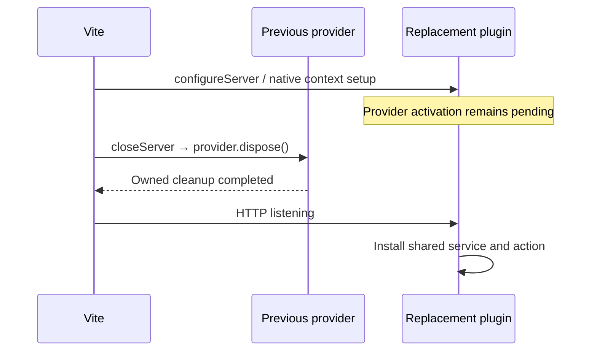

# Native Vite host examples

One counter capability, service and action run in both the released `@devframes/vite/hub` integration and the actual `@vitejs/devtools` Vite plugin. The recipes come from `examples/server-contexts`; this example adds native Vite lifecycle wiring. It does not implement a portable remote transport or a JSON counter view.

From the repository root:

```sh
pnpm exec turbo run build --filter=@devkit/example-vite-hosts... --concurrency=1
pnpm --filter @devkit/example-vite-hosts demo:devframe
# Or, in a separate terminal:
pnpm --filter @devkit/example-vite-hosts demo:devtools
```

Each demo starts a real Vite server bound to `127.0.0.1`, invokes the shared counter action and prints its value and provider identity. The server stays running; press `q` then Enter to close it and dispose the provider. Vite owns config watching, client HMR and its normal restart shortcuts. The Devframe variant mounts a headless hub; the DevTools variant mounts its native shell with optional built-in integrations disabled. Native authentication remains enabled. The SDK counter currently runs through the local typed API, not through that shell's UI.

`host.config.ts` calls `counterHostPlugins(mode)` inside a config factory. Every Vite config reload must create fresh native plugin instances. Reusing one inline plugin array across `server.restart()` is not the supported composition: upstream plugins capture mutable native host references in closures.

## Ownership and ordering

Vite 8.3.0 prepares a new server before awaiting teardown of the old one. Installing the provider eagerly inside `configureServer` would therefore start the replacement too soon. The example captures the native context during setup and activates portable contributions only after that server's HTTP `listening` event. Its application-level `closeServer` hook awaits provider disposal. Vite awaits that hook before listening with the replacement server.



`providerFromVite(server)` returns the current plugin's readiness promise. Await it after `listen()` or `restart()` before calling the example backend. `listen()` itself does not await asynchronous contribution activation. A saved handle remains bound to its original incarnation. Call `providerFromVite` again to acquire the replacement after restart.

The small `ProviderLifetime` class is private to this example. It neither watches files nor recreates servers. It removes its listening callback during disposal, handles closing before activation, and retains the original disposal promise. Cleanup failures reject `server.close()` and remain available in installation snapshots and diagnostics. The native host has already shut down by `closeServer`; contribution cleanup must not depend on an open native network connection.

## Verified behavior

Twelve integration tests use real Vite servers, actual native hosts, temporary filesystem fixtures and built public package exports. Every row runs for both hosts.

| Case                           | Assertion                                                                                                                                        |
| ------------------------------ | ------------------------------------------------------------------------------------------------------------------------------------------------ |
| Startup and HTTP mounting      | The native connection metadata responds; shared action and state work; actual hub/kit contexts are exposed; owned command disappears on close    |
| Delayed cleanup during restart | Restart stays pending with HTTP closed until cleanup resolves; old binding becomes unavailable; provider ID stays stable and incarnation changes |
| Cleanup failure                | Vite close rejects, the installation remains `cleanup-blocked`, and diagnostics are logged                                                       |
| Close before listening         | No provider activates and the readiness promise rejects                                                                                          |
| Watched config edit            | A real file write triggers Vite's own restart, disposes old contributions and produces a callable replacement                                    |
| Ordinary client module edit    | Vite invalidates and retransforms the module while provider identity and counter state remain intact                                             |

```sh
pnpm --filter @devkit/example-vite-hosts typecheck
pnpm --filter @devkit/example-vite-hosts lint
pnpm --filter @devkit/example-vite-hosts format:check
pnpm --filter @devkit/example-vite-hosts test
```

Tests require permission to bind ephemeral loopback ports. Watched cases enable Vite HMR because Vite's config-restart handling runs through that path. The fixture waits for the watcher’s public `ready` event and uses filesystem polling. macOS can deliver delayed creation events for an unchanged temporary config after `ready`, which otherwise causes unrelated restarts during client-edit tests. Polling still observes real file changes through Vite; tests do not simulate watcher events or replace native hosts with mocks. This setting is confined to temporary test fixtures.

## Built assets with a live preview backend

After building the example's dependency graph:

```sh
pnpm --filter @devkit/example-vite-hosts build:site
pnpm --filter @devkit/example-vite-hosts preview:devframe
# Or:
pnpm --filter @devkit/example-vite-hosts preview:devtools
```

Both commands serve the same Vite-built site and invoke the live counter action, printing `3` and the provider identity. Press `q` then Enter to close. These examples use a loopback HTTP/1 server without TLS. They do not mount the native DevTools UI in preview or render a JSON counter view.

`counterPreviewPlugin(host)` uses public `configurePreviewServer` and `closePreviewServer` hooks. It attaches the actual native backend to Vite's HTTP server and mounts live metadata before static assets. `providerFromVite(previewServer)` resolves its installed provider. The DevTools context has no `viteServer`, since preview does not have a development module graph. Native authentication remains enabled.

The example disposes portable contributions before closing its native backend. A contribution cleanup failure remains visible while native transport cleanup still runs. Repeated disposal shares the original promise. Startup failure also attempts owned cleanup and retains both errors if cleanup fails.

Six additional integration tests cover both hosts against freshly built browser source:

| Case                       | Assertion                                                                                            |
| -------------------------- | ---------------------------------------------------------------------------------------------------- |
| Production output          | HTTP serves the actual built HTML and emitted JavaScript                                             |
| Live metadata              | Native WebSocket metadata takes precedence over a conflicting static metadata file                   |
| Native context and actions | The same counter action and state work; genuine hub/kit context is available; `viteServer` is absent |
| Delayed cleanup            | Preview close waits for contribution cleanup and removes upgrade listeners                           |
| Failed cleanup             | Close rejects, the installation stays `cleanup-blocked`, and native transports still close           |

The maintained suite now has 23 tests covering native development/preview hosts, watched production retention and process exit. The watched workflow is documented below. Remote SDK dispatch, browser rendering and automatic production asset reload remain open.

## Remaining host contract work

- Failed native setup and changes during activation need further real-host evidence. Failed-restart replacement cleanup is a documented Vite gap accepted by the owner; the [upstream source proposal](../../docs/probes/vite-failed-restart/source-validation/README.md) is separate and no Vite dependency patch is installed.
- Development middleware mode is explicitly rejected. Bundled development and browser-side HMR delivery are not established by these tests.
- Discovery, remote dispatch, authentication conformance, JSON rendering and extension hosts remain separate implementation work. The native connection-metadata request is not an SDK RPC transport test.

These limits keep issues [6](https://github.com/dvcol/devkit-extension/issues/6), [13](https://github.com/dvcol/devkit-extension/issues/13) and [14](https://github.com/dvcol/devkit-extension/issues/14) open.

## Watched production with a live backend

Build the example's dependency graph once, then start the combined command:

```sh
pnpm --filter @devkit/example-vite-hosts... run build
pnpm --filter @devkit/example-vite-hosts run dev:production
```

`dev:production` uses `pnpm --workspace-concurrency=2 run "/^(build:watch|preview)$/"`. The two underlying scripts remain independently runnable, including starting preview before the first build:

```sh
pnpm --filter @devkit/example-vite-hosts run build:watch
pnpm --filter @devkit/example-vite-hosts run preview
```

The default preview backend is Devframe. Set `DEVKIT_HOST=devtools` on `preview` or the combined command to select the native DevTools backend. Both scripts use the example's `.devkit-production` directory. Preview reports HTTP 503 until a complete build exists. Its live backend can already accept authorized native connections during that interval.

Vite owns compilation and source watching. On its real `BUNDLE_END` event, `watchProduction(config, directory)` copies the completed staging output into a new immutable directory and atomically publishes its status file. This happens after output-writing hooks complete. Failed builds publish `phase: 'failed'` with the error and retain the previous generation. The watcher logs failures; `/__build-status` returns the current status without caching.

`productionPreviewPlugin(directory)` redirects the example entry page into that generation, and Vite serves its relative asset URLs. Older generation URLs remain valid after subsequent builds. Refreshing the entry page selects the latest complete build. Rebuilding assets does not recreate the backend or reset its counter. `readProductionStatus(directory)` exposes the same validated local status for orchestration.

| Piece                                               | Maintained execution proof                                                                                      |
| --------------------------------------------------- | --------------------------------------------------------------------------------------------------------------- |
| Preview starts before watcher                       | Real HTTP 503 and starting status, with a working native backend                                                |
| `buildStart` and successful `BUNDLE_END`            | Real watched source edits publish distinct complete generations                                                 |
| Syntax, `generateBundle` and `writeBundle` failures | Previous HTML and JavaScript remain byte-identical; HTTP status reports failure                                 |
| Recovery and old URLs                               | New output becomes active while old asset URLs retain their original contents                                   |
| Provider lifetime                                   | Native counter state and provider incarnation survive asset failures and rebuilds in both hosts                 |
| Writer ownership                                    | A second simultaneous publisher is rejected; `close()` is idempotent and releases its lock and process listener |
| Watcher restart                                     | A failed first build after restart retains the last complete published generation                               |
| Process exit                                        | An actual child process publishes stopped status and releases its lock synchronously                            |

The exact combined command was also run on macOS: watcher and preview started concurrently, HTTP returned the built page and native WebSocket metadata, and Ctrl+C stopped both children with `phase: 'stopped'` and no publisher lock. pnpm reports the interrupted preview task as a nonzero exit on Ctrl+C.

This maintained example covers a single HTML application with relative asset URLs on local HTTP/1. It retains generated directories until they are removed after stopping both scripts. The exclusive publisher lock is intentionally not stolen from another process; after an uncatchable termination such as SIGKILL, stop any remaining publisher before deleting the stale lock. Crash consistency, Windows filesystem behavior, multiple output layouts and generation pruning are not established by this example.

Automatic browser refresh/HMR, a renderer-mounted failure view, remote portable SDK calls and state restoration after backend replacement remain separate implementation work. The current browser document does not update itself merely because a new generation is available.
