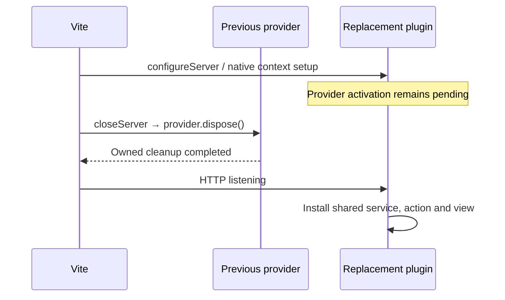
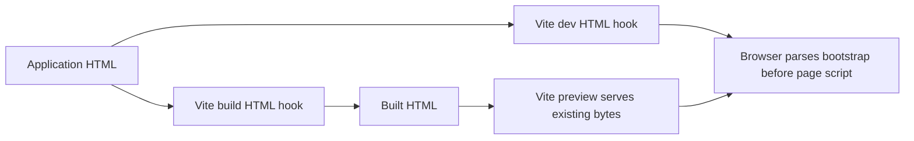
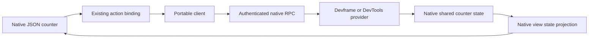

# Native Vite host examples

One counter capability, service, action and view run in both the released `@devframes/vite/hub` integration and the actual `@vitejs/devtools` Vite plugin. Service/action recipes come from `examples/server-contexts`; the view recipe comes from `@devkit/example-json-render/view`. This example adds native Vite lifecycle wiring. The page imports the published native reference renderer and dispatches through the existing portable client over native RPC.

From the repository root:

```sh
pnpm exec turbo run build --filter=@devkit/example-vite-hosts... --concurrency=1
pnpm --filter @devkit/example-vite-hosts demo:devframe
# Or, in a separate terminal:
pnpm --filter @devkit/example-vite-hosts demo:devtools
```

Each demo starts a real Vite server bound to `127.0.0.1`, invokes the shared counter action and prints its value and provider identity. The server stays running; press `q` then Enter to close it and dispose the provider. Vite owns config watching, client HMR and its normal restart shortcuts. The Devframe variant mounts a headless hub; the DevTools variant mounts its native shell with optional built-in integrations disabled. Native authentication remains enabled. Open the application URL to use its JSON counter. Devframe consumes a terminal OTP link or prompts for the current terminal code; no token is compiled into the assets. The application page mounts its own imported native reference renderer. It does not mount inside the separate DevTools shell.

`host.config.ts` calls `counterHostPlugins(mode)` inside a config factory. Every Vite config reload must create fresh native plugin instances. Reusing one inline plugin array across `server.restart()` is not the supported composition: upstream plugins capture mutable native host references in closures.

## Ownership and ordering

Vite 8.3.0 prepares a new server before awaiting teardown of the old one. Installing the provider eagerly inside `configureServer` would therefore start the replacement too soon. The example captures the native context during setup and activates portable contributions only after that server's HTTP `listening` event. Its application-level `closeServer` hook awaits provider disposal. Vite awaits that hook before listening with the replacement server.


```mermaid
sequenceDiagram
    participant Vite
    participant Old as Previous provider
    participant New as Replacement plugin
    Vite->>New: configureServer / native context setup
    Note over New: Provider activation remains pending
    Vite->>Old: closeServer → provider.dispose()
    Old-->>Vite: Owned cleanup completed
    Vite->>New: HTTP listening
    New->>New: Install shared service, action and view
```

`providerFromVite(server)` returns the current plugin's readiness promise. Await it after `listen()` or `restart()` before calling the example backend. `listen()` itself does not await asynchronous contribution activation. A saved handle remains bound to its original incarnation. Call `providerFromVite` again to acquire the replacement after restart.

The small `ProviderLifetime` class is private to this example. It owns the provider, whose startup plugin owns the native counter view and state subscription through the accepted setup recipe. It neither watches files nor recreates servers. It removes its listening callback during disposal, handles closing before activation, and retains the original disposal promise. This example requires the view to activate at startup and rolls back the provider if the admitted view plugin is not ready. Cleanup failures reject `server.close()` and remain available in installation snapshots and diagnostics. The native host has already shut down by `closeServer`; contribution cleanup must not depend on an open native network connection.

## Verified behavior

Fourteen integration tests use real Vite servers, actual native hosts, temporary filesystem fixtures and built public package exports. Every row runs for both hosts.

| Case                           | Assertion                                                                                                                                        |
| ------------------------------ | ------------------------------------------------------------------------------------------------------------------------------------------------ |
| Startup and HTTP mounting      | The native connection metadata responds; shared action and state work; actual hub/kit contexts are exposed; owned command disappears on close    |
| View contribution lifecycle    | Disable and dependency loss remove native state/index entries; enable and dependency restoration publish the current business state              |
| Delayed cleanup during restart | Restart stays pending with HTTP closed until cleanup resolves; old binding becomes unavailable; provider ID stays stable and incarnation changes |
| Cleanup failure                | Vite close rejects, the installation remains `cleanup-blocked`, and diagnostics are logged                                                       |
| Close before listening         | No provider activates and the readiness promise rejects                                                                                          |
| Watched config edit            | A real file write triggers Vite's own restart, disposes old contributions and produces a callable replacement                                    |
| Ordinary client module edit    | Vite invalidates and retransforms the module while provider identity and counter state remain intact                                             |

```sh
pnpm --filter @devkit/example-vite-hosts typecheck
pnpm --filter @devkit/example-vite-hosts lint
pnpm --filter @devkit/example-vite-hosts format:check
pnpm --filter @devkit/example-vite-hosts test
```

Tests require permission to bind ephemeral loopback ports. Watched cases enable Vite HMR because Vite's config-restart handling runs through that path. The fixture waits for the watcher’s public `ready` event and uses filesystem polling. macOS can deliver delayed creation events for an unchanged temporary config after `ready`, which otherwise causes unrelated restarts during client-edit tests. Polling still observes real file changes through Vite; tests do not simulate watcher events or replace native hosts with mocks. This setting is confined to temporary test fixtures.

Two [startup-failure tests](./tests/startup-failure.test.ts) use an independent plugin's public `devtools.setup` hook to register the same native view before the example publishes its counter. Both development and preview reject readiness with the example's view-activation error and roll back the new provider; the diagnostic sink retains the native duplicate-view error. Native command events confirm service registration and removal; the catalog becomes unavailable, and retained action and capability RPC methods reject as unavailable. In development, native HTTP metadata still responds and the foreign view remains editable. Preview rejects startup and removes its native transport's upgrade listeners. The library build keeps the public `/view` import external so it shares native duplicate detection with other plugins. This proves rollback after provider installation in the DevTools composition; it does not establish failures during native host setup or cancellation during activation.

## Built assets with a live preview backend

After building the example's dependency graph:

```sh
pnpm --filter @devkit/example-vite-hosts build:site
pnpm --filter @devkit/example-vite-hosts preview:devframe
# Or:
pnpm --filter @devkit/example-vite-hosts preview:devtools
```

Both commands serve the same Vite-built site and invoke the live counter action, printing `3` and the provider identity. Press `q` then Enter to close. These examples use a loopback HTTP/1 server without TLS. The built application renders the same native JSON counter and calls the attached live backend. Its assets are independent of the selected backend: a site built in `devframe` mode also works with the DevTools preview host.

`counterPreviewPlugin(host)` uses public `configurePreviewServer` and `closePreviewServer` hooks. It attaches the actual native backend to Vite's HTTP server and mounts live metadata before static assets. `providerFromVite(previewServer)` resolves its installed provider. The DevTools context has no `viteServer`, since preview does not have a development module graph. Native authentication remains enabled.

The example supplies its owned DevTools context's public `host.resolveOrigin` callback from the actual preview server's resolved URL. Without this binding, the native DevTools host falls back to the development port when composing authentication links. The callback fails clearly before preview has a resolved listening URL; it does not guess an origin or change authentication.

The example disposes portable contributions before closing its native backend. A contribution cleanup failure remains visible while native transport cleanup still runs. Repeated disposal shares the original promise. Startup failure also attempts owned cleanup and retains both errors if cleanup fails.

Six additional integration tests cover both hosts against freshly built browser source:

| Case                       | Assertion                                                                                            |
| -------------------------- | ---------------------------------------------------------------------------------------------------- |
| Production output          | HTTP serves the actual built HTML and emitted JavaScript                                             |
| Live metadata              | Native WebSocket metadata takes precedence over a conflicting static metadata file                   |
| Native context and actions | The same counter action and state work; genuine hub/kit context is available; `viteServer` is absent |
| Delayed cleanup            | Preview close waits for contribution cleanup and removes upgrade listeners                           |
| Failed cleanup             | Close rejects, the installation stays `cleanup-blocked`, and native transports still close           |

The maintained suite now has 28 tests covering native development/preview hosts, view contribution lifecycle, publication rollback, watched production retention and process exit. The watched workflow is documented below. The browser suite below verifies remote SDK dispatch and rendering; a fresh Chromium 153 run passes on the migrated recipe for both hosts in development, preview and watched production. Automatic production asset reload remains open.

## Remaining host contract work

- Failed native setup and changes during activation need further real-host evidence. Failed-restart replacement cleanup is a documented Vite gap accepted by the owner; the [upstream source proposal](../../docs/probes/vite-failed-restart/source-validation/README.md) is separate and no Vite dependency patch is installed.
- Development middleware mode is explicitly rejected. Bundled development and browser-side HMR delivery are not established by these tests.
- The browser composition uses native discovery over its two known same-origin metadata bases. General endpoint discovery and complete authentication/host conformance remain separate work. Extension hosts have their own maintained example and tests.

These limits keep issues [6](https://github.com/dvcol/devkit-extension/issues/6), [13](https://github.com/dvcol/devkit-extension/issues/13) and [14](https://github.com/dvcol/devkit-extension/issues/14) open.

## Watched production with a live backend

Build the example's dependency graph once, then start the combined command:

```sh
pnpm --filter @devkit/example-vite-hosts... run build
pnpm --filter @devkit/example-vite-hosts run dev:production
```

`dev:production` uses `pnpm --workspace-concurrency=2 run "/^(build:watch|preview)$/"`. The two underlying scripts remain independently runnable, including starting preview before the first build:

```sh
pnpm --filter @devkit/example-vite-hosts run build:watch
pnpm --filter @devkit/example-vite-hosts run preview
```

The default preview backend is Devframe. Set `DEVKIT_HOST=devtools` on `preview` or the combined command to select the native DevTools backend. Both scripts use the example's `.devkit-production` directory. Preview reports HTTP 503 until a complete build exists. Its live backend can already accept authorized native connections during that interval.

Vite owns compilation and source watching. On its real `BUNDLE_END` event, `watchProduction(config, directory)` copies the completed staging output into a new immutable directory and atomically publishes its status file. This happens after output-writing hooks complete. Failed builds publish `phase: 'failed'` with the error and retain the previous generation. The watcher logs failures; `/__build-status` returns the current status without caching.

`productionPreviewPlugin(directory)` redirects the example entry page into that generation, and Vite serves its relative asset URLs. Older generation URLs remain valid after subsequent builds. Refreshing the entry page selects the latest complete build. Rebuilding assets does not recreate the backend or reset its counter. `readProductionStatus(directory)` exposes the same validated local status for orchestration.

| Piece                                               | Maintained execution proof                                                                                                                                                  |
| --------------------------------------------------- | --------------------------------------------------------------------------------------------------------------------------------------------------------------------------- |
| Preview starts before watcher                       | Real HTTP 503 and starting status, with a working native backend                                                                                                            |
| `buildStart` and successful `BUNDLE_END`            | Real watched source edits publish distinct complete generations                                                                                                             |
| Syntax, `generateBundle` and `writeBundle` failures | Previous HTML and JavaScript remain byte-identical; HTTP status reports failure                                                                                             |
| Recovery and old URLs                               | New output becomes active while old asset URLs retain their original contents                                                                                               |
| Provider lifetime                                   | Native counter state and provider incarnation survive asset failures and rebuilds in both hosts                                                                             |
| Writer ownership                                    | A second simultaneous publisher is rejected before reading status; invalid status releases the acquired lock; `close()` releases its lock and process listener idempotently |
| Watcher restart                                     | A failed first build after restart retains the last complete published generation                                                                                           |
| Process exit                                        | An actual child process publishes stopped status and releases its lock synchronously                                                                                        |

The exact combined command was also run on macOS: watcher and preview started concurrently, HTTP returned the built page and native WebSocket metadata, and Ctrl+C stopped both children with `phase: 'stopped'` and no publisher lock. pnpm reports the interrupted preview task as a nonzero exit on Ctrl+C.

This maintained example covers a single HTML application with relative asset URLs on local HTTP/1. It retains generated directories until they are removed after stopping both scripts. The exclusive publisher lock is intentionally not stolen from another process; after an uncatchable termination such as SIGKILL, stop any remaining publisher before deleting the stale lock. Crash consistency, Windows filesystem behavior, multiple output layouts and generation pruning are not established by this example.

Automatic production browser refresh/HMR, a renderer-mounted build-failure view and state restoration after backend replacement remain separate implementation work. The current browser document does not update itself merely because a new generation is available.

## Native HTML bootstrap timing

[htmlBootstrapPlugin](./src/html-bootstrap.ts) uses Vite's public `transformIndexHtml` hook to prepend a classic inline script to the example's root HTML. During development, `createHtmlBootstrapFeature` supplies the native hook plus a `defineScript` contribution in the actual provider. Setup enables the hook and scope cleanup disables it for future HTML responses. Independent builds use the native hook directly. It changes neither the backend lifecycle nor Vite's watcher, and adds no HTTP response-transform pipeline.

The [site's first page script](./site/index.html) immediately freezes the bootstrap marker and its own `document.readyState`. Its visible output shows both values. Run either normal `demo:*` command, or build the site and run either `preview:*` command above.


```mermaid
flowchart LR
  Source[Application HTML] --> Dev[Vite dev HTML hook]
  Dev --> Browser[Browser parses bootstrap before page script]
  Source --> Build[Vite build HTML hook]
  Build --> Files[Built HTML]
  Files --> Preview[Vite preview serves existing bytes]
  Preview --> Browser
```

The [real browser test](./tests/browser.ts) uses the maintained host configuration and actual native backends. It confirms the active provider identity and the native JSON counter in each mode. Preview also serves exactly the built HTML and never invokes the test's HTML transform hook. The [recorded Chromium 153.0.8010.12 receipt](./evidence/html-timing.json) passed with zero observed page errors.

| Native host | Vite mode       | Bootstrap at first page script | Page readyState | Preview transform calls |
| ----------- | --------------- | ------------------------------ | --------------- | ----------------------- |
| Devframe    | Development     | `loading`                      | `loading`       | Not applicable          |
| DevTools    | Development     | `loading`                      | `loading`       | Not applicable          |
| Devframe    | Build / preview | `loading`                      | `loading`       | 0                       |
| DevTools    | Build / preview | `loading`                      | `loading`       | 0                       |

```sh
pnpm exec turbo run build --filter=@devkit/example-vite-hosts --concurrency=1
pnpm --filter @devkit/example-vite-hosts test:browser
```

CI runs this command after installing Chromium. It opens an owned browser, binds temporary loopback servers and removes temporary build output. Fresh timing, counter and watched-preview results go to ignored `artifacts/html-timing.json`; screenshots use `artifacts/{devframe,devtools}-{development,preview}.png`. The browser suite also disables/enables the script contribution on both development hosts, verifies native first-script effects and a fresh activation generation, then runs the existing counter and watch checks. The 28 host lifecycle tests remain separate. A [live in-app browser confirmation](./evidence/script-contribution-live.json) records the same timing changes with retained provider identity and counter state.

This example uses a classic script because module scripts defer. `head-prepend` controls HTML placement; Vite hook `order` controls transformation processing, not browser scheduling. Preview does not reapply HTML hooks. The owned site has no CSP; applications with CSP must allow the script through their own policy, such as Vite's native `html.cspNonce`. This is not evidence of arbitrary HTTP response rewriting or execution on deployed pages. Firefox execution of this Vite fixture and CSP cases remain outside this slice. [The common script declaration](../../docs/planning/011-portable-script-declaration.md) owns registration setup and cleanup; disabling the preview backend cannot remove code already emitted into production HTML.

References: [Vite HTML hook](https://vite.dev/guide/api-plugin#transformindexhtml), [Vite CSP support](https://vite.dev/guide/features#content-security-policy-csp), [native script execution](https://developer.mozilla.org/en-US/docs/Web/HTML/Reference/Elements/script).

## Browser counter and live backend

The application discovers `/__devframes/__connection.json` or `/__devtools/__connection.json` through native `connectDevframe`. It uses an isolated native connection, so each reload requests trust through that backend's OTP flow. The native metadata base identifies the example host; the presence of Vite's HMR client distinguishes development from built preview. Build-time mode does not select the live backend.

The existing `createDevframeProviderConnection` supplies an authorized catalog to `createClient`. `createActionCall` binds the shared action descriptor to that client; the native reference renderer, state subscriptions and all other RPC methods retain native behavior. A diagnostic button also invokes the shared read capability. The provider owns the view recipe; UI mounting retains native renderer and authentication APIs.

The page observes the native view index. Removal aborts that mount's action binding and disposes its renderer, then evicts native cached state after any pending mount settles. Republication creates one fresh mount from current state unless the user manually unmounted it. The browser suite disables the actual counter service, writes native business state while the view is absent, and reenables it on both development and preview hosts. It verifies the old button is detached, the manual unmount remains respected, and one fresh click changes the restored value from 20 to 21.


```mermaid
flowchart LR
  View[Native JSON counter] --> Binding[Existing action binding]
  Binding --> Client[Portable client]
  Client --> RPC[Authenticated native RPC]
  RPC --> Provider[Devframe or DevTools provider]
  Provider --> State[Native shared counter state]
  State --> Projection[Native view state projection]
  Projection --> View
```

The maintained Chromium suite covers both hosts in development and in independently built preview. Two pages authenticate with native single-use OTPs, and the fragment is removed. Actual JSON buttons update both pages; remote capability reads agree. Unmounting one renderer leaves backend state available to its peer; remounting sees that current state and one click has one effect. Explicit Disconnect closes that page's connection. The actual Reload to reconnect button creates a fresh document and uses the native authentication prompt. Closing the backend unmounts both pages and disables their controls. This establishes explicit reconnect, not automatic recovery.

Both watched-preview cases start the backend before assets exist, then build the maintained site with Vite's actual watcher. A source HTML edit publishes a second generation while the first page and provider stay alive. Opening the new generation sees the same counter; actions still update both documents, and the old generated HTML remains available. No browser reload controller is added. These cases do not replace the separate failed-build retention tests.

Pagehide and Vite module disposal release the browser's renderer, adapter, router and native connection. Host teardown releases the view projection and native view alongside the provider. The native JSON model and renderer remain framework-neutral at their authoring boundary; the reference renderer's internal framework is unchanged. Firefox execution of this Vite fixture and full authentication/HMR failure coverage remain unproved here.

An in-app Chromium 154 confirmation also ran the actual `demo:devframe` command: a native terminal OTP link authenticated the page, the JSON action changed the counter from 3 to 4, the capability read returned 4, and unmount/remount retained 4. A source edit triggered Vite's native page reload; a fresh native OTP link restored the view with the same provider incarnation and value. Explicit Disconnect removed the renderer and disabled its controls. This manual confirmation used the native OTP link, not automated interaction with a prompt dialog.

The in-app confirmation then ran `build:site` in `devframe` mode and `preview:devtools`. The built page connected as `example.devtools-preview`, increased 3 to 4, and read 4 through the capability. Closing that backend removed the view and disabled the controls. This run exposed the incorrect native preview authentication-link origin corrected by the callback above.
