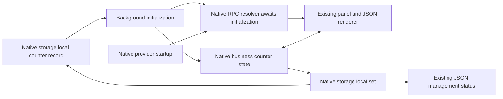

# Opt-in native counter persistence

The extension example can restore its counter from one `storage.local` key. Without an explicit key it remains ephemeral, including the existing forced-worker-termination scenario that resets the counter to zero.

Use the same shell environment variable with either native development command:

```sh
VITE_COUNTER_STORAGE_KEY=example.persisted-counter pnpm --filter @devkit/example-webext dev
VITE_COUNTER_STORAGE_KEY=example.persisted-counter pnpm --filter @devkit/example-webext dev:firefox
```

Build both browser artifacts with:

```sh
VITE_COUNTER_STORAGE_KEY=example.persisted-counter pnpm --filter @devkit/example-webext build
```

This writes `dist/chromium-persistent` and `dist/firefox-persistent`, leaving the default artifacts intact. Load the appropriate directory in a development browser. The opted-in manifest includes `storage`; the default manifest does not. Both Vite and WXT explicitly compile the key from the shell environment, so a key found only in a `.env` file cannot accidentally enable storage without its manifest permission. Restart the development command to change the key or opt out. There is no runtime persistence toggle.

The key belongs to this example's background within the browser's extension/profile namespace. Choose a distinct key for an independent counter. The example neither removes the saved key on panel closure nor deletes unrelated keys. Changing the build output path, extension identity or browser profile can select a different native storage namespace.



Native business state and Port listeners register synchronously. Provider startup activates the view recipe and its native publication. The native RPC resolver waits for the initial storage read and provider startup before returning the original handler. It does not buffer messages or add a readiness protocol. Read errors become throwing handlers because native birpc serializes handler errors; a directly rejected resolver would bypass that error boundary. The panel's existing failed-startup path displays the error and removes its mounts.

Only `{ value: integer }` is saved. Missing data uses the counter's initial zero; malformed records reject startup and remain untouched. The background subscribes once to native counter-state changes, so both portable actions and native state writes can save a new value. Provider identity, domain input, action feedback, management status and diagnostic execution counters remain ephemeral. Service or view disable/enable and panel reconnect do not create another persistence subscription. Removing the view leaves the native business counter intact; reenabling projects its latest value. External edits to the saved record are read on the next background startup; this example does not add storage-change replication or conflict resolution.

Writes remain asynchronous native operations. An action can finish before its write, and a failed write does not roll back live shared state. The JSON management view reports each value's write completion or failure, and the background logs failures. Overlapping writes follow native browser behavior; a status names the value whose operation completed, not a guarantee that all writes have finished. There is no flush, retry, durable-action acknowledgement or recovery controller. Correcting saved data requires an explicit fresh background before its clients reconnect.

## Maintained proof

```sh
VITE_COUNTER_STORAGE_KEY=example.persisted-counter pnpm --filter @devkit/example-webext build
VITE_COUNTER_STORAGE_KEY=example.persisted-counter pnpm --filter @devkit/example-webext exec node tests/chromium-persistence.ts
VITE_COUNTER_STORAGE_KEY=example.persisted-counter pnpm --filter @devkit/example-webext exec node tests/firefox-persistence.ts
pnpm --filter @devkit/example-webext test
```

The disposable Chromium test uses the actual extension, Ports, renderer and native storage. It confirms the opted-in permission, shares action and native-state updates between two pages, and reads the stored `{ value: 10 }` before issuing CDP `ServiceWorker.stopWorker`. It observes actual worker termination and loss of both page connections. Explicit page reloads start a provider with the same ID/realm and a different incarnation, restore 10 without replay, and mount one counter and one management view per page. The next action reaches 11 in both pages and storage. A separate key remains unchanged, and the edited page's local domain input resets.

The test also fills native local storage to its measured Chromium quota of 10,485,760 bytes. The next counter action changes live state from 9 to 10 while the native write rejects with `Resource::kQuotaBytes quota exceeded`; both pages show the failure and storage still contains 9. Removing only the filler does not retry that write. The next explicit action persists 11. Invalid saved input rejects both page startups without overwrite; correcting the record and explicitly starting another worker restores 7.

Finally, the test closes the entire Chromium instance and reopens the same disposable profile with the same unpacked extension path. Two fresh pages restore the confirmed saved value 7 under a new provider incarnation, each with one counter and management mount. One rendered action updates both pages and storage to 8. The independent key still contains 44. This proves normal browser shutdown and restart with unchanged extension/profile identity; it does not simulate a crash or interrupt an outstanding write.

The module tests replace only browser storage/Port I/O. They execute the real background, native MessageChannel RPC and native shared state to cover dispatch held during initialization, original receiver and missing-method behavior, serialized read rejection, strict saved-shape validation, write failure and removal of the owning subscription. Vitest reports unhandled errors normally; the tests add no error suppression to production.

Chromium 153.0.8010.12 passed with zero page errors before and after browser restart. [Receipt](./evidence/persistence/chromium.json), [restored UI](./evidence/persistence/chromium.png), [native quota failure](./evidence/persistence/chromium-quota.png), [UI after browser restart](./evidence/persistence/chromium-restart.png). Fresh runs write the same artifacts under `artifacts/persistence`, retained by CI.

The Firefox test uses the public `chrome.runtime.reload()` API after observing the saved counter at 10. It verifies that both old extension tabs close. Explicit replacement tabs restore 10 under the same provider ID/realm and a different incarnation, with one counter and management mount in each. One JSON action then reaches 11 in both pages and storage. A separate key retains 44; diagnostic execution state changes from 1 started/1 completed before reload to 0/0 afterward. Firefox 157.0 passed this actual extension-reload scenario. [Receipt](./evidence/persistence/firefox.json), [restored UI](./evidence/persistence/firefox.png). WebDriver Classic does not provide the global page-error capture used by the Chromium test.

## Firefox full browser restart with explicit fixture loading

```sh
VITE_COUNTER_STORAGE_KEY=example.persisted-counter pnpm --filter @devkit/example-webext exec vite build --mode firefox
VITE_COUNTER_STORAGE_KEY=example.persisted-counter pnpm --filter @devkit/example-webext test:persistence:firefox:restart
```

Set `FIREFOX_BINARY` to an already installed Firefox executable when needed. The maintained test passed on stable Firefox 157.0 with geckodriver 0.37.1. It starts two separate native browser sessions against one disposable profile. Native `driver.quit()` closes the first session, and a process-liveness assertion confirms that its Firefox process has exited before the replacement starts. The receipt records distinct Firefox process IDs, WebDriver session IDs and document handles/time origins, alongside the unchanged profile path, extension ID and extension UUID.

The unsigned test extension is temporarily installed through the native add-on API in each session. Firefox retains its native storage and UUID in the same profile; the second session does not rewrite that UUID or copy, seed or edit storage files. Two initial clients share an action and a direct native-state write, and the test reads the saved `{ value: 10 }` through `storage.local` before shutdown. After restart and explicit fixture loading, two fresh clients restore 10 under a new provider incarnation, with exactly one counter and management mount per document. One rendered action reaches 11 in both peers and native storage. The independent key retains 44, and diagnostic execution state resets from 1/1 to 0/0. Native caller numbers can restart with a new background; their provider incarnation and actual document/session lifetimes distinguish the new clients.

Successful runs write their receipt and screenshot under `artifacts/persistence`, then close both owned browser sessions and remove the disposable profile. CI retains those artifacts. [Retained restart receipt](./evidence/persistence/firefox-browser-restart.json), [restored UI](./evidence/persistence/firefox-browser-restart.png). This proves stable Firefox state restoration after a full clean browser shutdown and restart with explicit test-fixture loading. It does not establish permanent installation or automatic extension availability after restart. Stable Firefox rejects the unsigned fixture's permanent installation with `ERROR_SIGNEDSTATE_REQUIRED`; [Mozilla's signing requirements](https://extensionworkshop.com/documentation/publish/signing-and-distribution-overview/) require a signed extension for that separate release-browser case. [Geckodriver's in-place profile argument](https://firefox-source-docs.mozilla.org/testing/geckodriver/Profiles.html) preserves the actual profile between sessions; Selenium's `setProfile` would clone a template instead.

## Natural Chromium worker idle

```sh
VITE_COUNTER_STORAGE_KEY=example.persisted-counter pnpm --filter @devkit/example-webext build
VITE_COUNTER_STORAGE_KEY=example.persisted-counter pnpm --filter @devkit/example-webext test:persistence:chromium:idle
```

The [idle runner](./tests/chromium-idle.ts) launches the native browser against the existing production extension build in a disposable profile. Its test-only CDP connection attaches to page sessions and observes worker targets/status through an otherwise blank page. It never attaches to the extension worker, forces termination, shortens native idle timers or reloads the extension. Playwright's ordinary worker attachment prevents this natural-idle proof, so the runner uses the browser's existing CDP endpoint directly. The extension build's hash remains unchanged throughout the test.

Two initial native Port clients confirm counter 10 in `storage.local`, retain an independent key at 44 and complete one diagnostic action. They stay open and quiet during the observation interval. Chromium 153.0.8010.12 naturally destroyed the unattached worker after 30,011 ms; native worker status independently reported `stopped`. Both original documents retained their time origins, changed to Disconnected and removed their counter/management views. Explicit fresh pages then started a new native worker and provider incarnation, restored 10 and mounted each view once. One rendered action reached 11 in both clients and native storage. The independent key stayed 44, ephemeral input/execution state reset and the completed diagnostic action was not replayed.

Page sessions observe native `Runtime.exceptionThrown` events; the successful run captured no page exceptions or worker errors. Native browser cleanup exited the owned process and removed the disposable profile. CI runs the same command and retains its generated artifacts. [Retained receipt](./evidence/persistence/chromium-idle.json), [restored UI](./evidence/persistence/chromium-idle.png).

This proves Chromium natural idle and explicit fresh-client recovery after confirmed writes. Completed operations precede idle; pending calls can affect native keepalive and remain covered separately by forced-worker acceptance. There is no automatic reconnection or replay. Firefox natural suspension and interrupted native writes remain unproved.

## Natural Firefox event-page idle

```sh
VITE_COUNTER_STORAGE_KEY=example.persisted-counter pnpm --filter @devkit/example-webext build
VITE_COUNTER_STORAGE_KEY=example.persisted-counter pnpm --filter @devkit/example-webext test:persistence:firefox:idle
```

Set `FIREFOX_BINARY` to an installed Firefox executable when needed. The [idle runner](./tests/firefox-idle.ts) loads the native temporary fixture once in a disposable profile. A privileged WebDriver parent-process observer watches Firefox's own background suspend/status notifications without opening a DevTools toolbox, polling an extension API, reloading the add-on or changing its idle timer. The observed native timeout is 30,000 ms with no user override. The production extension build's hash stays unchanged during the test.

Stable Firefox 157.0 suspended its running background context and reported `stopped` 29,923 ms after observation began. Observation starts after the last native client work, so that interval is not a measurement from the native timer's reset. The background context disappeared while the browser process, WebDriver session, profile, add-on ID and extension UUID remained unchanged. Both quiet production Port panels retained their original documents, disconnected and unmounted their counter/management views. Explicit fresh clients started a new background context and provider incarnation, restored confirmed counter 10 and mounted each view once. One rendered action saved 11, the independent key retained 44, ephemeral state reset and the completed diagnostic action was not replayed.

Successful runs write the receipt and screenshot under `artifacts/persistence`, remove the native observer, quit the owned browser and remove its profile. Process-liveness checks confirm Firefox exited. CI runs this scenario and retains its artifacts. [Retained receipt](./evidence/persistence/firefox-idle.json), [restored UI](./evidence/persistence/firefox-idle.png). WebDriver Classic does not provide global page-error capture here. Native Firefox startup warnings and a `PrivateBrowsingUtils.sys.mjs:50` shutdown error also reproduced in two comparison sessions with the same native fixture preparation and no new observer, quitting from either WebDriver context. Both comparison sessions exited and cleaned up normally; the fixture adds no suppression or browser workaround.

This proves natural Firefox event-page idle and explicit fresh-client recovery after confirmed writes. It does not prove pending-RPC suspension, interrupted I/O, automatic reconnection or permanent add-on availability.

These checks establish forced Chromium worker termination, natural idle in both browsers, normal Chromium browser restart, explicit Firefox extension reload and Firefox browser restart with explicit fixture loading **after a confirmed storage write**. They do not establish interruption of an outstanding write, crash recovery, persistence across uninstall, cross-profile synchronization or concurrent external-writer behavior. Firefox's permanent-install/automatic-availability, quota and interrupted-write behavior remain unproved. The default Chromium and Firefox examples retain their separate native regression suites.
