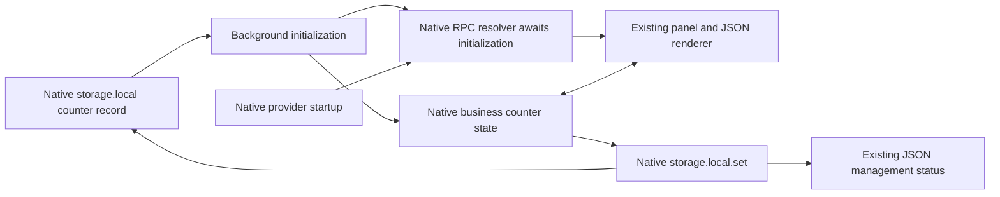

# Opt-in native counter persistence

The extension example can restore its counter from one `storage.local` key. Without an explicit key it remains ephemeral, including the existing forced-worker-termination scenario that resets the counter to zero.

Use the same shell environment variable with either native development command:

```sh
VITE_COUNTER_STORAGE_KEY=example.persisted-counter pnpm --filter @devkit/example-webext dev
VITE_COUNTER_STORAGE_KEY=example.persisted-counter pnpm --filter @devkit/example-webext dev:firefox
```

Build both browser artifacts with:

```sh
VITE_COUNTER_STORAGE_KEY=example.persisted-counter pnpm --filter @devkit/example-webext build
```

This writes `dist/chromium-persistent` and `dist/firefox-persistent`, leaving the default artifacts intact. Load the appropriate directory in a development browser. The opted-in manifest includes `storage`; the default manifest does not. Both Vite and WXT explicitly compile the key from the shell environment, so a key found only in a `.env` file cannot accidentally enable storage without its manifest permission. Restart the development command to change the key or opt out. There is no runtime persistence toggle.

The key belongs to this example's background within the browser's extension/profile namespace. Choose a distinct key for an independent counter. The example neither removes the saved key on panel closure nor deletes unrelated keys. Changing the build output path, extension identity or browser profile can select a different native storage namespace.



Native business state and Port listeners register synchronously. Provider startup activates the view recipe and its native publication. The native RPC resolver waits for the initial storage read and provider startup before returning the original handler. It does not buffer messages or add a readiness protocol. Read errors become throwing handlers because native birpc serializes handler errors; a directly rejected resolver would bypass that error boundary. The panel's existing failed-startup path displays the error and removes its mounts.

Only `{ value: integer }` is saved. Missing data uses the counter's initial zero; malformed records reject startup and remain untouched. The background subscribes once to native counter-state changes, so both portable actions and native state writes can save a new value. Provider identity, domain input, action feedback, management status and diagnostic execution counters remain ephemeral. Service or view disable/enable and panel reconnect do not create another persistence subscription. Removing the view leaves the native business counter intact; reenabling projects its latest value. External edits to the saved record are read on the next background startup; this example does not add storage-change replication or conflict resolution.

Writes remain asynchronous native operations. An action can finish before its write, and a failed write does not roll back live shared state. The JSON management view reports each value's write completion or failure, and the background logs failures. Overlapping writes follow native browser behavior; a status names the value whose operation completed, not a guarantee that all writes have finished. There is no flush, retry, durable-action acknowledgement or recovery controller. Correcting saved data requires an explicit fresh background before its clients reconnect.

## Maintained proof

```sh
VITE_COUNTER_STORAGE_KEY=example.persisted-counter pnpm --filter @devkit/example-webext build
VITE_COUNTER_STORAGE_KEY=example.persisted-counter pnpm --filter @devkit/example-webext exec node tests/chromium-persistence.ts
VITE_COUNTER_STORAGE_KEY=example.persisted-counter pnpm --filter @devkit/example-webext exec node tests/firefox-persistence.ts
pnpm --filter @devkit/example-webext test
```

The disposable Chromium test uses the actual extension, Ports, renderer and native storage. It confirms the opted-in permission, shares action and native-state updates between two pages, and reads the stored `{ value: 10 }` before issuing CDP `ServiceWorker.stopWorker`. It observes actual worker termination and loss of both page connections. Explicit page reloads start a provider with the same ID/realm and a different incarnation, restore 10 without replay, and mount one counter and one management view per page. The next action reaches 11 in both pages and storage. A separate key remains unchanged, and the edited page's local domain input resets.

The test also fills native local storage to its measured Chromium quota of 10,485,760 bytes. The next counter action changes live state from 9 to 10 while the native write rejects with `Resource::kQuotaBytes quota exceeded`; both pages show the failure and storage still contains 9. Removing only the filler does not retry that write. The next explicit action persists 11. Invalid saved input rejects both page startups without overwrite; correcting the record and explicitly starting another worker restores 7.

Finally, the test closes the entire Chromium instance and reopens the same disposable profile with the same unpacked extension path. Two fresh pages restore the confirmed saved value 7 under a new provider incarnation, each with one counter and management mount. One rendered action updates both pages and storage to 8. The independent key still contains 44. This proves normal browser shutdown and restart with unchanged extension/profile identity; it does not simulate a crash or interrupt an outstanding write.

The module tests replace only browser storage/Port I/O. They execute the real background, native MessageChannel RPC and native shared state to cover dispatch held during initialization, original receiver and missing-method behavior, serialized read rejection, strict saved-shape validation, write failure and removal of the owning subscription. Vitest reports unhandled errors normally; the tests add no error suppression to production.

Chromium 153.0.8010.12 passed with zero page errors before and after browser restart. [Receipt](./evidence/persistence/chromium.json), [restored UI](./evidence/persistence/chromium.png), [native quota failure](./evidence/persistence/chromium-quota.png), [UI after browser restart](./evidence/persistence/chromium-restart.png). Fresh runs write the same artifacts under `artifacts/persistence`, retained by CI.

The Firefox test uses the public `chrome.runtime.reload()` API after observing the saved counter at 10. It verifies that both old extension tabs close. Explicit replacement tabs restore 10 under the same provider ID/realm and a different incarnation, with one counter and management mount in each. One JSON action then reaches 11 in both pages and storage. A separate key retains 44; diagnostic execution state changes from 1 started/1 completed before reload to 0/0 afterward. Firefox 157.0 passed this actual extension-reload scenario. [Receipt](./evidence/persistence/firefox.json), [restored UI](./evidence/persistence/firefox.png). WebDriver Classic does not provide the global page-error capture used by the Chromium test.

These checks establish forced Chromium worker termination, normal Chromium browser restart and explicit Firefox extension reload **after a confirmed storage write**. They do not establish natural idle suspension, interruption of an outstanding write, crash recovery, persistence across uninstall, cross-profile synchronization or concurrent external-writer behavior. Firefox's full browser restart, quota and interrupted-write behavior remain unproved. The default Chromium and Firefox examples retain their separate native regression suites.
