# Native WebExtension example

This Manifest V3 example runs the same background module as a Chromium service worker or a Firefox event page, with two packaged pages using the maintained `@devkit/webext` channel. It publishes a native JSON view, mounts the existing reference renderer and synchronizes native shared state. The worker installs the shared counter action/capability contracts through `@devkit/devframe`; both pages attach its catalog to `@devkit/client` for typed selection, broadcast and lifecycle updates. All runtime imports resolve through the workspace's pinned, patched Devframe 1.0 packages. No upstream checkout or source alias is required.

```sh
pnpm exec turbo run build --filter=@devkit/example-webext --concurrency=1
pnpm --filter @devkit/example-webext exec playwright install chromium
pnpm --filter @devkit/example-webext test:browser
pnpm --filter @devkit/example-webext test:firefox
```

Load `examples/webext/dist/chromium` unpacked in Chromium, or load `examples/webext/dist/firefox/manifest.json` as a temporary add-on from Firefox’s `about:debugging`. Open the extension's options page or its toolbar popup. Both mount the same native JSON view and use independent connections to the background provider. Its only host permission is `http://127.0.0.1/*`, for local backends and selected local pages. The `scripting` permission reads a native descriptor from a selected page.

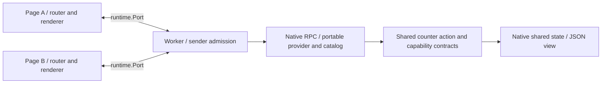

The worker admits only its own extension ID, expected channel name and exact packaged page URL. Its native RPC metadata retains each actual sender. The channel uses Devframe's records serializer. Native state accepts normal native writes, and view publication retains one context object for its index and duplicate detection. Each page owns its RPC close, state mirrors and renderer disposal. Disconnect does not cancel remote side effects or replay an action.

The Chromium test uses a disposable profile and removes it afterward. Its 39 scenarios cover native Port RPC/state/rendering and disposal, portable action/capability calls, catalog updates in both clients, configured-server routing and the selected-page handoff below. The [recorded run](./evidence/receipt.json) lists every scenario and passed with zero page errors. Fresh runs write their screenshot and receipt under ignored `artifacts/`.

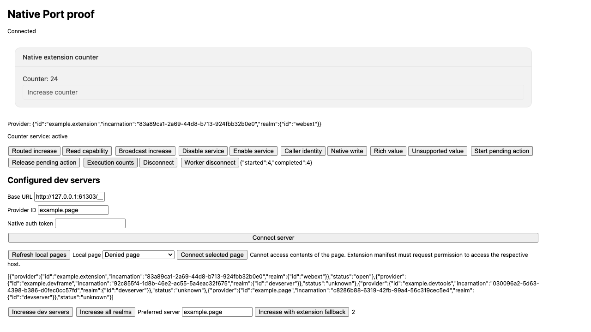

`pnpm --filter @devkit/example-webext test` also builds the extension and rejects Node or browser-external modules in the graph. Both build modes assert the expected native background manifest, permissions and CSP. CI runs these checks through the normal workspace gates, then executes both real-browser tests.

This is the native extension foundation. Explicit server connections, cross-provider JSON action dispatch and the recorded browser-surface HMR cases are implemented below. Automatic discovery, content/page request bridging and complete browser/reload conformance remain open. Native server view discovery is covered below; its full host/lifecycle matrix is still incomplete. The separate [debugger example](../debugger/README.md) owns debugger and optional CDB evidence. Worker termination can reset in-memory state; persistence remains host/contribution-owned. The exact native dependency backports and their removal conditions are recorded in [the patch inventory](../../patches/README.md).

## Firefox execution

`test:firefox` uses Selenium WebDriver Classic with Firefox 156.0.1 and geckodriver 0.37.1. Selenium Manager resolves the driver; CI pins both versions. Set `FIREFOX_BINARY` to use a specific Firefox executable. For example, on macOS:

```sh
FIREFOX_BINARY=/Applications/Firefox.app/Contents/MacOS/firefox \
  SE_DRIVER_VERSION=0.37.1 SE_SKIP_DRIVER_IN_PATH=true pnpm --filter @devkit/example-webext test:firefox
```

The driver owns a temporary profile, assigns this add-on a test-only origin UUID and removes the session on exit. Its `--allow-system-access` option permits automation of `moz-extension` documents; it is never applied to a normal browsing profile. WebDriver Classic provides working extension-page navigation. Firefox BiDi currently omits extension-page lifecycle events, causing Puppeteer navigation to time out, as tracked in [Puppeteer #14314](https://github.com/puppeteer/puppeteer/issues/14314).

The [Firefox receipt](./evidence/firefox/receipt.json) records 32 scenario groups. They cover real Port RPC, native rendering/state, rich values, disconnection, catalog updates, mixed Devframe/DevTools/extension routing, native origin/auth rejection and selected-page handoff. These tests assert actual browser DOM and backend state. WebDriver Classic does not provide global page-error capture here, so this receipt makes no zero-page-error claim. The Chromium receipt still includes that assertion. Both suites open actual options pages and toolbar popups through native APIs. Both suites also exercise the real DevTools panel and browser sidebar lifetimes described below.

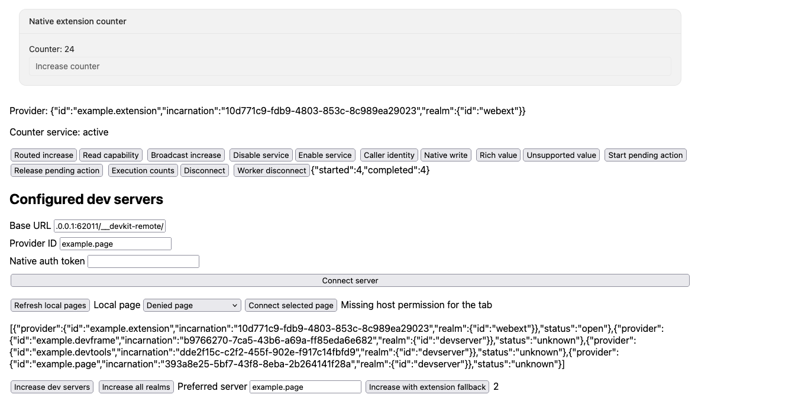

The example declares `script-src 'self'` and limits `connect-src` to itself and loopback HTTP/WebSocket endpoints. This explicit CSP omits Firefox's default `upgrade-insecure-requests`, which otherwise upgrades the local `ws:` endpoint to `wss:` and prevents connection. [Mozilla documents this native behavior](https://developer.mozilla.org/en-US/docs/Mozilla/Add-ons/WebExtensions/Content_Security_Policy#upgrade_insecure_network_requests_in_manifest_v3). Packaged code, host permissions, native origin admission and native RPC authentication remain enforced. No SDK transport or Devframe patch is added for Firefox.

## Options and popup lifecycle

The manifest points both native hosts at the same packaged `panel.html`. Shared CSS gives the popup a usable minimum width, wraps provider details and leaves vertical scrolling to the browser. The application keeps the existing renderer, Port connection and page teardown; there is no separate popup runtime.

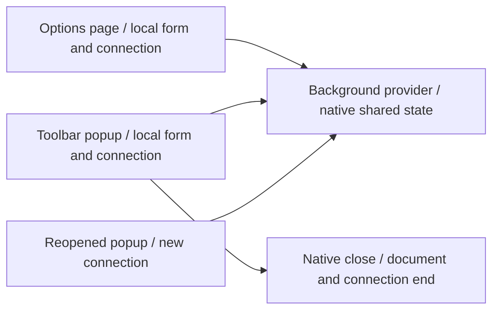

| Interaction                 | Observed behavior in Chromium and Firefox                                                            |
| --------------------------- | ---------------------------------------------------------------------------------------------------- |
| Native options opening      | Opens the configured page; repeated opening reuses an existing page                                  |
| Popup opening               | Native popup registry contains one real view; the JSON renderer shows current background state       |
| Rendered popup action       | Counter increases once and the options page receives the same state                                  |
| Service disable/enable      | Both catalogs update; the popup's routed action rejects while unavailable                            |
| Pending action during close | Popup view disappears; the surviving options page can release the already dispatched action          |
| Popup reopening             | New caller, empty local form/result, same provider incarnation and current counter; no action replay |

The shared browser scenario in `tests/native-surfaces.ts` runs through both maintained production suites. It uses native `runtime.openOptionsPage`, `action.openPopup` and `extension.getViews({ type: 'popup' })`. From the surviving options document, it inspects and clicks the actual popup DOM, including its native JSON renderer. It never substitutes an ordinary tab for a popup or adds application test hooks. Firefox invalidates closed-window references, so closure is observed through the native view registry.

The retained screenshots show the surviving options page after the popup checks, not a recreated popup. Popup sizing is asserted on the actual window, including absence of horizontal overflow. This proves packaged popup/options behavior. The development checks below cover popup module HMR and HTML reload separately. Background suspension remains open. Cross-provider JSON action dispatch is covered by the dedicated scenario below.

## Native DevTools panel

Open the browser's DevTools on a normal page and select **Devkit**, using the overflow tab menu if needed. `devtools.html` makes one native `chrome.devtools.panels.create` call pointing to the existing `panel.html`. WXT recognizes that HTML entrypoint for development; the production build emits the same `devtools_page`. No additional extension permission, SDK host abstraction or renderer wrapper is required.

Hiding the panel preserves its document, caller and native state subscription. Closing DevTools ends the document and connection. Reopening creates a new caller against the same live background provider. The tests click actual JSON-rendered actions, observe the options peer, hide/show around a peer update, close with an action pending, release it from options, and verify reopening does not replay it.

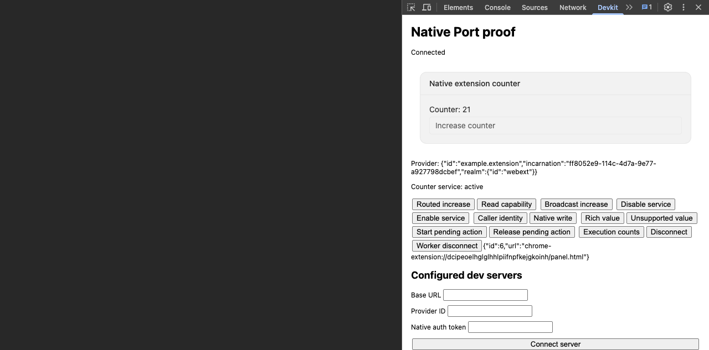

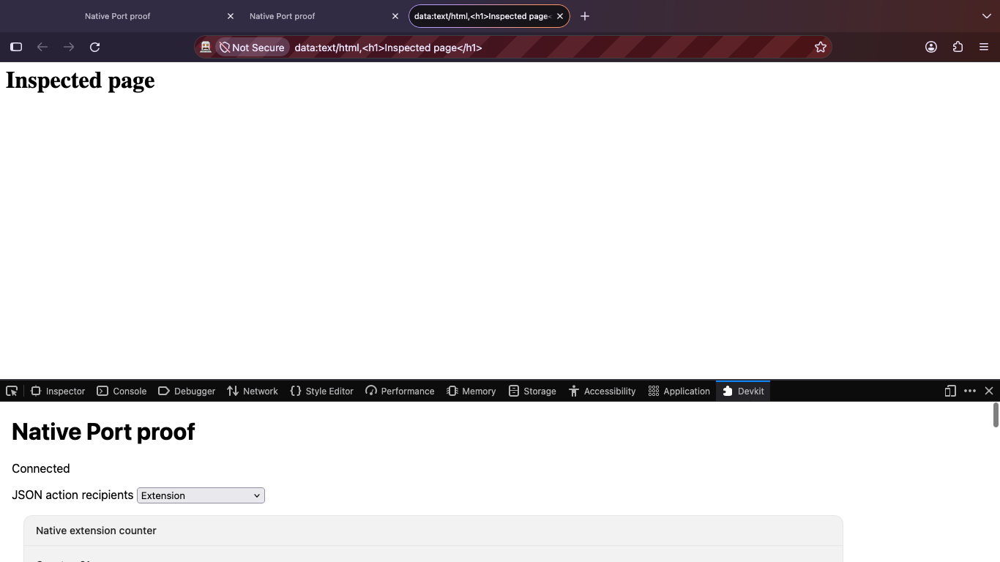

Chromium automation uses public CDP target APIs because Playwright omits the DevTools frontend from ordinary pages. It selects the actual native extension tab with the browser's next-panel shortcut. The CDP observer exists only in tests and uses the pinned Chromium version's experimental target APIs.

Firefox automation uses the existing isolated WebDriver system context and native F12/DevTools controls. Public frame switching and BiDi omit the remote XUL panel browser. One test-only helper therefore calls the pinned Firefox version's existing private `MarionetteCommands` actor to inspect that actual document. It waits for the final extension document, since querying the temporary blank document races its destruction. This is a browser-test maintenance dependency, not an SDK or application API. No testing endpoint is shipped with the extension.

These production checks cover the built host and its native document lifetime. The maintained development tests below also cover panel module and HTML updates. Inspected-page backend discovery, debugger authority and navigation policy remain separate work. The panel uses the same background provider and explicit connection controls as options and popup.

## Browser sidebars

The Chromium manifest adds `side_panel.default_path` and the native `sidePanel` permission. The Firefox manifest adds `sidebar_action.default_panel`, with `open_at_install: false`. Both point to the existing `panel.html`; they share the renderer and background provider while retaining their own document and Port.

For Chromium, right-click the extension's toolbar entry and choose its native side-panel opening command. The browser supplies this menu for extensions with a side panel, as shown in [Chromium's context-menu implementation](https://github.com/chromium/chromium/blob/main/chrome/browser/extensions/extension_context_menu_model.cc). For Firefox, open the browser sidebar picker and select **Devkit**. The toolbar's ordinary click continues to open the popup.

| Native host                | Opening and tested lifetime                                                                                                                                                                   |
| -------------------------- | --------------------------------------------------------------------------------------------------------------------------------------------------------------------------------------------- |
| Chromium global side panel | `chrome.sidePanel.open({ windowId })` requires a user gesture. Tab changes and navigation retain its document. Native close removes its context; reopening creates a new document and caller. |
| Firefox sidebar            | Native sidebar controls open and close the configured page. Tab changes retain its document. Closing removes the view; reopening creates a fresh document and caller.                         |

The live tests use native pointer input on the sidebar's JSON-rendered counter, observe the options peer, complete an already dispatched action after closing, and verify that reopening retains provider state without replay. Chromium also verifies rejection after native user activation expires and local form retention/reset. Both assert that the actual narrow viewport has no horizontal overflow. Only an actual popup receives the minimum width used for intrinsic sizing; Firefox's DevTools context omits the optional native `getViews` method used for that detection.

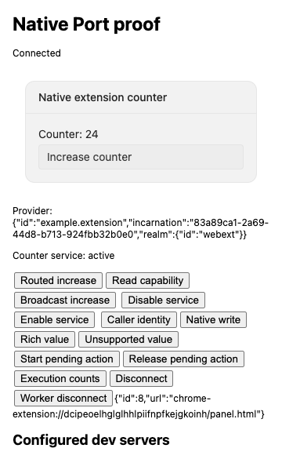

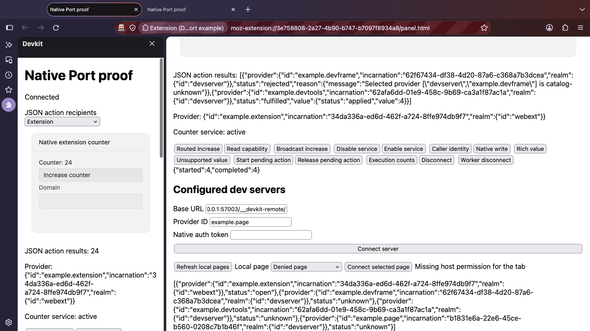

Chromium's driver identifies the real `SIDE_PANEL` runtime context and uses the same public CDP observer as the DevTools test. Firefox opens through its native sidebar picker and inspects the actual document through public `extension.getViews({ type: 'sidebar' })`. No additional private Firefox actor or application test hook is involved. See [Chrome's side-panel API](https://developer.chrome.com/docs/extensions/reference/api/sidePanel), [Firefox's sidebar manifest](https://developer.mozilla.org/en-US/docs/Mozilla/Add-ons/WebExtensions/manifest.json/sidebar_action), and [native view enumeration](https://developer.mozilla.org/en-US/docs/Mozilla/Add-ons/WebExtensions/API/extension/getViews).

In Firefox 156.0.1, the full browser-window screenshot omits the unhovered, semi-transparent button while a document screenshot paints the same unchanged state correctly. This was reproduced with both headless and normal Firefox. The sidebar evidence captures the button after native pointer activation, with its normal hover styling. The renderer's opacity styles remain unchanged.

These checks cover the default sidebar in one normal browser window. The development tests below also cover its module and HTML updates. Tab-specific Chromium configuration, multiple/private windows, worker suspension and sidebar-specific background/configuration transitions remain open. Sidebar mounting adds no inspected-page authority or target-routing policy.

## Provider and connection ownership

`src/provider.ts` defines the worker implementation of the same imported counter contracts used by the server examples. Its local native descriptor exposes the real JSON view; remote bindings contain only provider/execution metadata. The existing server adapter delegates to the same provider/catalog implementation, without pulling hub or kit dependencies into this worker.

Each page composes raw `createRpcClient`, its collector and native event emitter. Port closure calls `$close()` and emits the native disconnected status, so the shared adapter clears its catalog and local waits. The page then disposes its router, catalog subscription, state mirrors and renderer. Reopening the page creates a fresh connection to the same live provider, with no action replay.

The native entrypoint calls `startExampleBackground()` synchronously. Importing its implementation does not start a worker, which lets packaging tools inspect entrypoints safely. Startup reports asynchronous provider failures while registering `runtime.onConnect` immediately. Initialization failures are also visible to native RPC callers. Disabling the counter service invalidates both catalogs; the routed action rejects until the owner re-enables the service.

## Panel module replacement

The panel accepts native Vite HMR and disposes its old Port, renderer, router, subscriptions and DOM listeners before replacement. Abort signals prevent delayed commands or connection attempts from overwriting the replacement controls. They do not cancel remote side effects. Manual disconnect still displays pending-call errors.

Standalone WXT checks import this maintained source and exercise the actual reference renderer in [Chromium](../../docs/research/wxt-json-hmr-evidence/RECEIPT.md) and [Firefox](../../docs/research/wxt-firefox-json-hmr-evidence/RECEIPT.md). The observed document and provider survive, native state is retained, and post-update actions work without duplication. Chromium additionally verifies both old Ports close and exactly one routed-button listener remains. Both checks verify that a pending old action cannot overwrite the replacement UI.

A Chromium HTML reload retains background state. Native background reload, with normal Developer mode enabled, closes old extension documents and replaces the provider. A newly opened panel reads reset ephemeral state; interrupted actions are not replayed. The candidate's default fresh Chromium profile did not enable Developer mode effectively. A separate native dedicated-profile test passes after Chrome saves its normal one-time Developer mode setting; see the [setup evidence](../../docs/research/wxt-json-hmr-evidence/RECEIPT.md#native-dedicated-profile-setup).

## Native development commands

```sh
pnpm exec turbo run build --filter=@devkit/example-webext^... --concurrency=1
pnpm --filter @devkit/example-webext dev
# Or, in a separate session:
pnpm --filter @devkit/example-webext dev:firefox
```

WXT owns the Vite development server, browser process, HMR and native extension reloads. Each browser uses its own native Vite dependency cache under `.wxt/vite/<browser>`. This also keeps disposable fixture roots independent even though they share installed dependencies. A shared cache reproduced a 504 for the optimized renderer module during concurrent development; [diagnosis and evidence](../../docs/research/native-development-cache.md). Both commands use Manifest V3 and the same `entrypoints/panel.html`, panel implementation, background implementation and application manifest as the production Vite build. Application manifest metadata lives in the watched `wxt.config.ts`; the production build imports the same factory. WXT does not classify an imported manifest helper as a configuration change, so keeping those values in the actual configuration lets native version/permission edits trigger a restart. WXT adds its development transport and owns its generated background manifest. Development outputs live under `.output/`; production outputs remain `dist/chromium` and `dist/firefox`.

On the first Chromium launch, open `chrome://extensions` and enable **Developer mode**. Let Chrome save the setting before restarting it. The native runner retains this setup under `.wxt/chromium-profile`, separate from your ordinary browser profile. Disabling Developer mode can cause Chrome to disable the extension on a background reload. No protected preference values or policy controls are written by this example. Browser executable overrides use WXT's native `webExt.binaries` configuration.

| Edit                  | Native behavior                                       | Observed state                                                                               |
| --------------------- | ----------------------------------------------------- | -------------------------------------------------------------------------------------------- |
| Panel TypeScript      | Vite module replacement, old panel resources disposed | Same document/provider and native state, new connection in tabs, popup, DevTools and sidebar |
| Panel HTML            | Full page reload                                      | New document/caller, same provider/state in tabs, popup, DevTools and sidebar                |
| Background entrypoint | Extension reload; reopen the options page afterward   | New provider, reset ephemeral state, no automatic replay                                     |
| WXT configuration     | Native browser/server restart                         | Old browser exits; manifest changes take effect; new provider and reset ephemeral state      |

The maintained live tests use temporary copies of this example and disposable browser profiles. They drive the actual native JSON renderer through module, HTML, background and configuration changes in both browsers. The configuration check edits the application version from `0.0.1` to `0.0.2`, proves the old browser exits, then verifies the replacement manifest, new provider, reset counter and working action. Final native shutdown must also close the replacement browser. The retained [Chromium receipt](./evidence/development/chromium/receipt.json) and [Firefox receipt](./evidence/development/firefox/receipt.json) record passing runs on Chromium 153.0.8010.12 and Firefox 156.0.1. Chromium also checks a pending old command cannot overwrite replacement UI and confirms no page errors. Firefox observes native process shutdown; it does not claim global browser-error capture. Chromium verifies its native Developer mode setting survives restart. The test reads the platform's actual preference store and never writes protected values. Earlier frozen experiments retain the detailed listener/Port-count and upstream-runner comparisons.

Actual toolbar popups also receive module HMR and HTML reload in both browsers. The native `action.openPopup()` and `extension.getViews({ type: 'popup' })` APIs identify the real popup. A source edit retains its document and provider, replaces its Port caller, and leaves one working JSON action with current native state. Chromium additionally checks local form retention and completion of pre-update work without overwriting the replacement result. An HTML edit keeps the popup open but replaces its document/caller, retains provider/state, and leaves one JSON action whose effect reaches options once. Chromium also verifies the local form resets on HTML reload. Closing removes the popup from native view enumeration. These checks use the installed native WXT behavior and add no application hooks, reload manager or further dependency patch.

Actual DevTools panels and browser sidebars now exercise both module HMR and HTML reload in both browsers. Module updates retain the document/provider/state with a fresh caller. HTML updates replace the document/caller while retaining provider/state. Each update leaves one renderer button whose action reaches the options peer once. Chromium also checks that local form input survives HMR and resets on HTML reload. Native host close removes the panel or sidebar afterward.

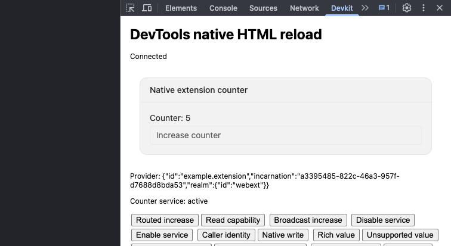

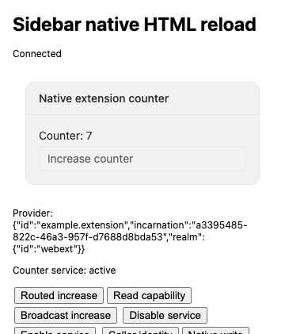

WXT originally reloaded every HTML entry in the rebuilt group, including unchanged `devtools.html`. That removed Firefox's Devkit tab after a `panel.html` edit. The [small WXT correction](../../docs/research/wxt-html-reload.md) compares emitted HTML and reloads changed pages through the existing native method. A real-build regression also checks shared transform output and missing snapshots. This does not handle direct changes to the DevTools registration page, whose native lifetime can require reopening the toolbox.

```sh
# Run both installed browsers concurrently:
pnpm --filter @devkit/example-webext test:dev
# Or run one browser:
pnpm --filter @devkit/example-webext test:dev:chromium
FIREFOX_BINARY=/path/to/firefox GECKODRIVER_BINARY=/path/to/geckodriver \
  pnpm --filter @devkit/example-webext test:dev:firefox
```

The Firefox test attaches to the browser WXT opened. Its isolated automation session needs Firefox's native system-access flag to inspect extension documents. It retains WebDriver's default page-load behavior; disabling that behavior leaves native sidebar clicks without the expected navigation binding. `GECKODRIVER_BINARY` is optional when the driver is discoverable. Receipts and screenshots are written under ignored `artifacts/`; CI runs both development tests concurrently after the production browser suites. Type checks prepare WXT declarations but retain the repository's strict TypeScript settings, including `skipLibCheck: false`.

On Linux CI only, the Chromium development test passes `--no-sandbox`, matching Playwright's existing test-launch default. The Ubuntu runner rejects the downloaded Chromium sandbox before CDP startup. This flag applies only to the disposable automated browser; the normal WXT development commands keep Chromium's default sandbox behavior. Native launch crashes print the owned browser's stderr before exiting.

The exact dependency corrections and removal gates are in the [patch inventory](../../patches/README.md#wxt-development-tooling). The packaged MAIN script reload case below is now checked separately. Further content/page updates, repeated rapid changes, popup/DevTools/sidebar background/config transitions and watched production remain open.

## Explicit native server connections

The form connects a base URL, configured provider ID and native authentication token through `connectDevframe({ connection: { isolated: true }, ... })`. `createDevframeProviderConnection` attaches its authorized catalog to the page's existing router. Each connection has its own native credentials and lifetime. Closing the page disposes these owned clients; startup failures close partially initialized clients. Tokens are cleared from the form and excluded from test logs.

The backend must include the actual extension origin, such as `chrome-extension://<installed-id>`, in native `initHub({ allowedOrigins })`. This is separate from native RPC authentication. Standard `initHub` does not publish the optional viewer-origin registration token, so calling `registerDevframeViewerOrigin` alone would not admit this viewer. The example uses the existing server option, without an upstream patch or disabling origin checks.

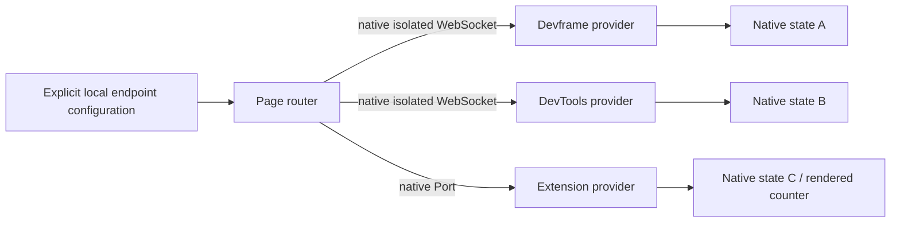

`tests/configured-servers.ts` starts real Devframe and DevTools backends using the same imported counter contracts. It proves denied origin and invalid credentials leave counters unchanged, both authorized connections coexist, a devserver-only broadcast excludes the extension, and an all-realm broadcast updates all three providers. Explicit preference selects Devframe; after its shutdown, a new invocation falls back to the extension. A subsequent broadcast returns a rejected Devframe outcome and a fulfilled DevTools result. No request is replayed after dispatch.

These controls demonstrate application-owned explicit configuration. The selected-page alternative below uses the same owned connection setup. The reference JSON view still renders the extension provider's native state; cross-provider view composition remains separate work.

## Selected-page handoff

**Refresh local pages** lists currently permitted loopback tabs. Select a page, enter its configured provider ID, and choose **Connect selected page**. The example reads `DEVFRAME_CONNECTION_KEY` once through native `scripting.executeScript` in that tab's top-level MAIN world. It then passes the published `DevframeConnection` to the same native client setup, with `isolated: true`. Native credentials remain local to that connection; they never enter the provider registry or page controls.

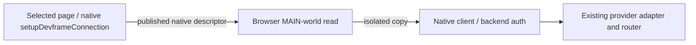

The browser supplies the selected tab/frame. The example checks only the native descriptor envelope, matching upstream's external-viewer integration. It does not authenticate page claims or duplicate Devframe's metadata types with a local schema. Browser host permissions, native server origin admission and native authentication still apply. Provider IDs remain application configuration because the native descriptor does not advertise SDK provider IDs.

`tests/selected-page.ts` serves a real Vite publisher whose native `setupDevframeConnection` fetches and publishes the descriptor. The extension adopts it and invokes the shared action. The test also verifies absent/malformed descriptors, a closed selection, and browser permission rejection for a tampered selection targeting `about:blank`. The publisher is not a fabricated Playwright connection object. Page errors from every browser page are collected.

This is a one-time handoff. Closing or navigating the source page does not retarget an already adopted backend connection; the extension page owns its disposal. The selected source gets no extension capabilities or RPC channel. No tab watcher, page-to-extension request protocol, persistent endpoint registry or credential store is added. Native `devtools.inspectedWindow.eval` remains the appropriate read API for an actual DevTools integration, whose surface lifecycle is still untested here.

## Packaged document-start scripts

The [script recipe](./src/script-timing.ts) is synchronous, browser-only code. Production Vite and WXT's native `defineUnlistedScript` entry both package it as `script-timing.js`. Application code registers that file through native `scripting.registerContentScripts` before navigating. No SDK script factory, page RPC bridge or injected extension authority is involved.

```ts
await chrome.scripting.registerContentScripts([
  {
    id: 'example-script-timing',
    js: ['script-timing.js'],
    matches: ['http://127.0.0.1/index.html'],
    runAt: 'document_start',
    world: 'MAIN', // Use 'ISOLATED' for extension-owned globals.
    allFrames: false,
    persistAcrossSessions: false,
  },
]);
// Registration affects matching future documents.
await chrome.scripting.unregisterContentScripts({ ids: ['example-script-timing'] });
```

The existing `scripting` and loopback host permissions cover this recipe. MAIN shares page globals and page trust; ISOLATED has separate globals while sharing the document. Unregistering affects future injection; it does not undo code that already ran.

The [first inline page script](./tests/script-timing/index.html) dispatches a plain synchronous event and records its observations immediately. The packaged listener writes its injection-time `readyState` to the shared DOM. This checks actual early execution in both worlds without timers, late-injection fallbacks or assuming that `documentElement` exists at injection time.

| Registration                   | Page sees bootstrap global | Already-installed listener reports | First page script state |
| ------------------------------ | -------------------------- | ---------------------------------- | ----------------------- |
| MAIN                           | `loading`                  | `loading`                          | `loading`               |
| ISOLATED                       | absent                     | `loading`                          | `loading`               |
| Removed, then fresh navigation | absent                     | absent                             | `loading`               |

The browser tests also read back the exact native registration, check an unmatched URL in each world, and confirm removal of the owned registration. Production bundle tests parse the artifact as a classic script and reject module dependencies. The same browser scenarios run in the native WXT development suites without changing WXT lifecycle behavior.

Recorded results: [Chromium production](./evidence/script-timing/chromium-production.json), [Firefox production](./evidence/script-timing/firefox-production.json), [Chromium development](./evidence/script-timing/chromium-development.json), [Firefox development](./evidence/script-timing/firefox-development.json). Chromium 153.0.8010.12 and Firefox 156.0.1 passed all four combinations. Fresh runs write `script-timing.json` in each command's existing artifact directory.

```sh
pnpm exec turbo run build --filter=@devkit/example-webext --concurrency=1
pnpm --filter @devkit/example-webext test:browser
pnpm --filter @devkit/example-webext test:firefox
pnpm --filter @devkit/example-webext test:dev
```

This proves top-level loopback documents registered before navigation. It does not establish child-frame/CSP coverage, persistence across browser restarts, mutation rollback, already-open document timing or ISOLATED-world script replacement during development. Native Vite HTML transformation and the generic script contribution contract remain separate work under [#11](https://github.com/dvcol/devkit-extension/issues/11).

Native references: [Chrome content script timing](https://developer.chrome.com/docs/extensions/develop/concepts/content-scripts), [registered-script fields](https://developer.mozilla.org/en-US/docs/Mozilla/Add-ons/WebExtensions/API/scripting/RegisteredContentScript), and [Mozilla's API compatibility data](https://raw.githubusercontent.com/mdn/browser-compat-data/main/webextensions/api/scripting.json). The latter records programmatic `world` support from Firefox 128; the actual Firefox run above confirms the maintained version.

## Packaged script changes during development

WXT treats a changed unlisted script as an extension reload. The maintained Chromium and Firefox development suites edit the temporary fixture's imported `src/script-timing.ts`, leaving the repository source untouched. The tests use normal file watching and native extension reload; no mock reload event, page reinjection or registration recovery is added.

Both actual browsers establish this sequence for MAIN-world scripts with `persistAcrossSessions: false`:

| Step                                | Native result                                                                                       |
| ----------------------------------- | --------------------------------------------------------------------------------------------------- |
| Initial registration and navigation | The script runs before the first page script.                                                       |
| Edit the imported packaged source   | WXT rebuilds it and reloads the extension; the old extension page closes and the provider changes.  |
| Observe the already-open page       | Its time origin, first-script snapshot and old global remain unchanged; the new revision is absent. |
| Read registrations after reload     | The owned registration is absent.                                                                   |
| Navigate before registering again   | The new document receives no injected marker.                                                       |
| Explicitly register, then navigate  | The next document receives the updated revision before its first page script.                       |
| Unregister and close                | The owned registration, page, native browser and fixture server are cleaned up.                     |

The before/after snapshots are retained in [Chromium's receipt](./evidence/script-timing/chromium-reload.json) and [Firefox's receipt](./evidence/script-timing/firefox-reload.json). Run the existing `test:dev:chromium`, `test:dev:firefox` or combined `test:dev` command. Both tests still execute their ordinary UI HMR, HTML/background reload and configuration restart checks.

Chromium's CDP observer receives browser exit asynchronously. After native WXT shutdown, the test uses Playwright's bounded assertion to observe disconnection; it does not assume the observer's cached flag has already changed when `stop()` resolves.

This proves native reload behavior for the selected MAIN case. It does not promise mutation rollback, in-place script replacement, automatic registration restoration, browser-restart persistence or ISOLATED-world reload semantics. A contribution that needs future injections after an extension restart must register again through its normal startup lifetime. Existing document effects remain application-owned.

## Native JSON actions across providers

The reference renderer's `rpc.call` is bound through `createActionCall` from `@devkit/devframe/client`. **Increase counter** uses the shared portable action against the extension provider. **Increase matching domain** broadcasts another shared action to the recipients selected by the local page. The JSON specification contains only the action ID and input expressions. The removed `probe:increase` background RPC is no longer needed.

| Domain                  | Extension implementation | Devframe and DevTools implementations |
| ----------------------- | ------------------------ | ------------------------------------- |
| `shared.example.test`   | Applies                  | Both apply                            |
| `dev.example.test`      | Not applicable           | Both apply                            |
| `deployed.example.test` | Applies                  | Not applicable                        |
| Any other domain        | Not applicable           | Not applicable                        |

Each provider installs the same example plugin with its own domain list. This is application logic. The SDK only selects recipients and carries validated inputs/results. A `not-applicable` value is a successful domain result; provider failures remain rejected outcomes beside successful siblings. The page displays outcomes locally in **JSON action results**, leaving each backend's native counter state independent. Choosing **All connected realms** requires both an extension and at least one configured development-server recipient, following the existing broadcast preflight contract.

```sh
pnpm --filter @devkit/example-webext test:json-actions
```

The dedicated Chromium scenario clicks actual JSON-rendered controls against three real backends. It checks realm/provider selection, provider applicability, two matching servers, unknown domains, unavailable/disconnected providers, native input binding/error callbacks and no dispatch after unmount. CI runs it separately from the existing Chromium and Firefox surface suites. The Firefox suite also drives the JSON control through real Devframe, DevTools and extension providers, including devserver/all-realm selection, explicit provider filtering, shared and provider-specific applicability, unknown-domain no-ops and partial failure after server disconnect. [Firefox receipt](./evidence/firefox/receipt.json). The retained detached domain-button check and the failed-selection/retry sequence remain Chromium-specific.

The reference renderer retains its last-error banner after a successful retry. This is a confirmed upstream error-lifecycle bug in `@devframes/json-render-ui`: its action bridge never resets the stored error. The example's `onSuccess` callback clears its own status and subsequent actions execute correctly. The [isolated reproduction and source diagnosis](../../docs/research/json-render-stale-action-error.md) also reproduce the failure with the unmodified npm renderer, without the extension or SDK. The current receipt and screenshot include the failed-selection/retry sequence; the dependency remains unfixed.

[Executed receipt](./evidence/json-actions.json) · [Rendered example](./evidence/json-actions.png)

## Native server views

Each configured server connection subscribes to Devframe's `JSON_RENDER_INDEX_KEY`. Existing and newly published entries mount through the unchanged bundled renderer. The page groups views by configured provider ID, using that connection's native shared state and RPC. Identical view IDs and state keys on different backends remain independent.

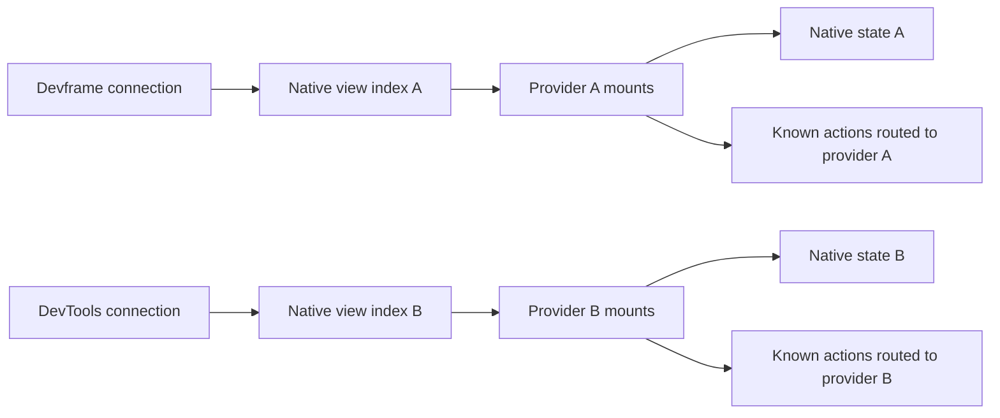

The index belongs to the native context, not the portable capability catalog. The example does not invent per-plugin view ownership, merge indexes or filter a host's published views by service availability. Empty indexes are valid. Imported counter actions use the existing `createActionCall` binding with an explicit provider; other native RPC calls stay on that connection. The separate broadcast controls retain their outgoing realm/provider selection.

Publish with the existing native API on an authenticated host:

```ts
const view = createJsonRenderView(context, {
  id: 'status',
  title: 'Server status',
  spec: {
    root: 'text',
    elements: { text: { type: 'Text', props: { text: 'Connected' } } },
  },
});
// Removing the entry unmounts this view without disconnecting its siblings.
view.dispose();
```

Use that host's base URL, native credential and configured provider ID in the connection form. Its native `allowedOrigins` must admit the extension origin, as described above. No additional discovery service or renderer runtime is needed.

```sh
pnpm --filter @devkit/example-webext build
pnpm --filter @devkit/example-webext test:json-views
```

The maintained command starts real Devframe and DevTools hosts and the packaged Chromium extension. The [receipt](./evidence/json-views.json) records existing/late publication, an empty index, identical keys with distinct values, portable actions, backend updates, removal and republishing, isolated server disconnect, page cleanup and fresh connection without replay. It also clicks retained detached buttons to verify the removed mount's action lifetime has ended. The [screenshot](./evidence/json-views.png) shows the surviving server and extension after the other server disconnects. Chromium 153.0.8010.12 passed with zero page errors. CI runs this command separately from JSON action broadcasting.

The implementation uses one cancellation signal per mount and disposes late asynchronous mounts if their entry has already been removed. It adds no public SDK API or dependency patch. Firefox view-index acceptance, multi-provider view HMR and the complete renderer catalog remain unproven by this command. Native RPC cancellation and state persistence retain their existing host semantics.
