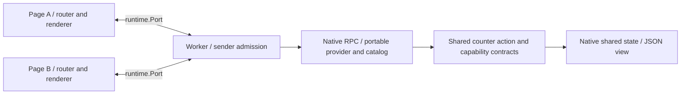
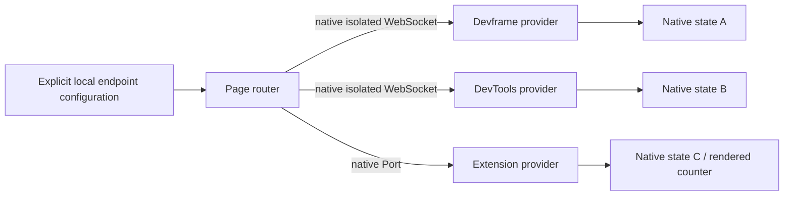
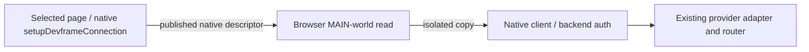

# Native WebExtension example

This Manifest V3 example runs a module service worker and two packaged pages using the maintained `@devkit/webext` channel. It publishes a native JSON view, mounts the existing reference renderer and synchronizes native shared state. The worker installs the shared counter action/capability contracts through `@devkit/devframe`; both pages attach its catalog to `@devkit/client` for typed selection, broadcast and lifecycle updates. All runtime imports resolve through the workspace's pinned, patched Devframe 1.0 packages. No upstream checkout or source alias is required.

```sh
pnpm exec turbo run build --filter=@devkit/example-webext --concurrency=1
pnpm --filter @devkit/example-webext exec playwright install chromium
pnpm --filter @devkit/example-webext test:browser
```

Load `examples/webext/dist` unpacked in Chromium to explore it manually. Open the extension's options page twice. The manifest also points its popup to that page; the automated test opens full pages and does not claim toolbar-popup lifecycle coverage. Its only host permission is `http://127.0.0.1/*`, for local backends and selected local pages. The `scripting` permission reads a native descriptor from a selected page.



The worker admits only its own extension ID, expected channel name and exact packaged page URL. Its native RPC metadata retains each actual sender. The channel uses Devframe's records serializer. Native state accepts normal native writes, and view publication retains one context object for its index and duplicate detection. Each page owns its RPC close, state mirrors and renderer disposal. Disconnect does not cancel remote side effects or replay an action.

The browser test uses a disposable Chromium profile and removes it afterward. Its 24 scenarios cover native Port RPC/state/rendering and disposal, portable action/capability calls, catalog updates in both clients, configured-server routing and the selected-page handoff below. The [recorded run](./evidence/receipt.json) lists every scenario and passed with zero page errors. Fresh runs write their screenshot and receipt under ignored `artifacts/`.


`pnpm --filter @devkit/example-webext test` also builds the extension and rejects Node or browser-external modules in the graph. CI runs that check through the normal workspace gates and then executes the real Chromium test.

This is the native extension foundation. Automatic discovery, cross-provider rendering, full popup/DevTools/side-panel lifecycle, content/page request bridging, debugger support, Firefox browser conformance and extension HMR remain open. Worker termination can reset in-memory state; persistence remains host/contribution-owned. The exact native dependency backports and their removal conditions are recorded in [the patch inventory](../../patches/README.md).

## Provider and connection ownership

`src/provider.ts` defines the worker implementation of the same imported counter contracts used by the server examples. Its local native descriptor exposes the real JSON view; remote bindings contain only provider/execution metadata. The existing server adapter delegates to the same provider/catalog implementation, without pulling hub or kit dependencies into this worker.

Each page composes raw `createRpcClient`, its collector and native event emitter. Port closure calls `$close()` and emits the native disconnected status, so the shared adapter clears its catalog and local waits. The page then disposes its router, catalog subscription, state mirrors and renderer. Reopening the page creates a fresh connection to the same live provider, with no action replay.

The worker registers `runtime.onConnect` synchronously. One narrowly scoped `prefer-top-level-await` lint exception permits reporting asynchronous provider startup failures without delaying worker event registration. Initialization failures are also visible to native RPC callers. Disabling the counter service invalidates both catalogs; the routed action rejects until the owner re-enables the service.

## Explicit native server connections

The form connects a base URL, configured provider ID and native authentication token through `connectDevframe({ connection: { isolated: true }, ... })`. `createDevframeProviderConnection` attaches its authorized catalog to the page's existing router. Each connection has its own native credentials and lifetime. Closing the page disposes these owned clients; startup failures close partially initialized clients. Tokens are cleared from the form and excluded from test logs.

The backend must include the actual extension origin, such as `chrome-extension://<installed-id>`, in native `initHub({ allowedOrigins })`. This is separate from native RPC authentication. Standard `initHub` does not publish the optional viewer-origin registration token, so calling `registerDevframeViewerOrigin` alone would not admit this viewer. The example uses the existing server option, without an upstream patch or disabling origin checks.



`tests/configured-servers.ts` starts real Devframe and DevTools backends using the same imported counter contracts. It proves denied origin and invalid credentials leave counters unchanged, both authorized connections coexist, a devserver-only broadcast excludes the extension, and an all-realm broadcast updates all three providers. Explicit preference selects Devframe; after its shutdown, a new invocation falls back to the extension. A subsequent broadcast returns a rejected Devframe outcome and a fulfilled DevTools result. No request is replayed after dispatch.

These controls demonstrate application-owned explicit configuration. The selected-page alternative below uses the same owned connection setup. The reference JSON view still renders the extension provider's native state; cross-provider view composition remains separate work.

## Selected-page handoff

**Refresh local pages** lists currently permitted loopback tabs. Select a page, enter its configured provider ID, and choose **Connect selected page**. The example reads `DEVFRAME_CONNECTION_KEY` once through native `scripting.executeScript` in that tab's top-level MAIN world. It then passes the published `DevframeConnection` to the same native client setup, with `isolated: true`. Native credentials remain local to that connection; they never enter the provider registry or page controls.



The browser supplies the selected tab/frame. The example checks only the native descriptor envelope, matching upstream's external-viewer integration. It does not authenticate page claims or duplicate Devframe's metadata types with a local schema. Browser host permissions, native server origin admission and native authentication still apply. Provider IDs remain application configuration because the native descriptor does not advertise SDK provider IDs.

`tests/selected-page.ts` serves a real Vite publisher whose native `setupDevframeConnection` fetches and publishes the descriptor. The extension adopts it and invokes the shared action. The test also verifies absent/malformed descriptors, a closed selection, and browser permission rejection for a tampered selection targeting `about:blank`. The publisher is not a fabricated Playwright connection object. Page errors from every browser page are collected.

This is a one-time handoff. Closing or navigating the source page does not retarget an already adopted backend connection; the extension page owns its disposal. The selected source gets no extension capabilities or RPC channel. No tab watcher, page-to-extension request protocol, persistent endpoint registry or credential store is added. Native `devtools.inspectedWindow.eval` remains the appropriate read API for an actual DevTools integration, whose surface lifecycle is still untested here.
