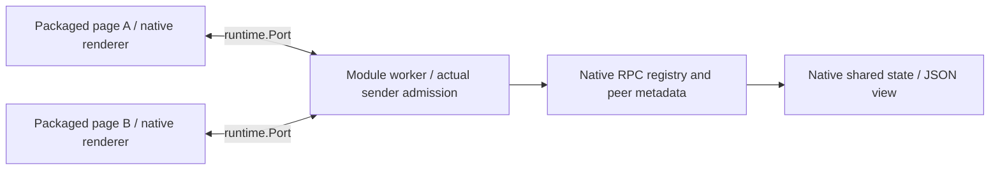

# Native WebExtension example

This Manifest V3 example runs a module service worker and two packaged pages using the maintained `@devkit/webext` channel. It publishes a native JSON view, mounts the existing reference renderer, invokes native RPC actions and synchronizes native shared state. All runtime imports resolve through the workspace's pinned, patched Devframe 1.0 packages. No upstream checkout or source alias is required.

```sh
pnpm exec turbo run build --filter=@devkit/example-webext --concurrency=1
pnpm --filter @devkit/example-webext exec playwright install chromium
pnpm --filter @devkit/example-webext test:browser
```

Load `examples/webext/dist` unpacked in Chromium to explore it manually. Open the extension's options page twice. The manifest also points its popup to that page; the automated test opens full pages and does not claim toolbar-popup lifecycle coverage. No host permissions are requested.



The worker admits only its own extension ID, expected channel name and exact packaged page URL. Its native RPC metadata retains each actual sender. The channel uses Devframe's records serializer. Native state accepts normal native writes, and view publication retains one context object for its index and duplicate detection. Each page owns its RPC close, state mirrors and renderer disposal. Disconnect does not cancel remote side effects or replay an action.

The browser test uses a disposable Chromium profile and removes it afterward. It verifies 12 scenarios: two real Ports, distinct asynchronous caller identity, native actions, native writes, Map/BigInt, rejected functions, pending-call rejection, renderer unmount, backend completion without replay, reconnect with retained state, denied admission with partial-mount cleanup, and worker-initiated disconnect. The [recorded run](./evidence/receipt.json) passed with zero page errors. Fresh runs write their screenshot and receipt under ignored `artifacts/`.


`pnpm --filter @devkit/example-webext test` also builds the extension and rejects Node or browser-external modules in the graph. CI runs that check through the normal workspace gates and then executes the real Chromium test.

This is the native extension foundation. Portable provider/catalog/router composition, full popup/DevTools/side-panel lifecycle, content/page bridging, debugger support, Firefox browser conformance and extension HMR remain open. Worker termination can reset in-memory state; persistence remains host/contribution-owned. The exact native dependency backports and their removal conditions are recorded in [the patch inventory](../../patches/README.md).
