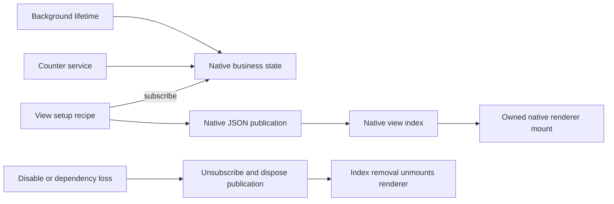

# View contribution lifetime

The background installs `createCounterView` from `@devkit/example-json-render/view` in its view plugin. The same browser-safe recipe runs on Devframe, DevTools and Vite hosts. Its typed counter requirement ties publication to service availability; its activation scope owns native view disposal and the business-state subscription.

The background owns the native counter state separately. Portable actions, native writes and optional browser storage use that state directly. Disabling the counter service removes the counter publication and its rendered mounts. Management remains available to enable the service again. Reenable republishes the current counter, including native writes performed while the view was absent.

The panel owns renderer mounts and their native client subscriptions. Removed publication keys release those resources before a replacement reads the same key. Backend state remains independent. Surface close still disposes its connection and all remaining mounts. No SDK cache, renderer protocol or automatic recovery layer is added.

Maintained Chromium and Firefox browser scenarios remove the counter while retaining management, write the business value while absent, reenable exactly one current view, and verify a detached old action cannot change it. Native background tests verify index removal and publication of the restored value. Optional persistence tests verify the same data path across worker termination, extension reload and Chromium restart; see [persistence](./PERSISTENCE.md).

The declaration settles recipe ownership. Native popup, panel and sidebar placement remains host-owned; complete browser/surface/HMR conformance remains open.
